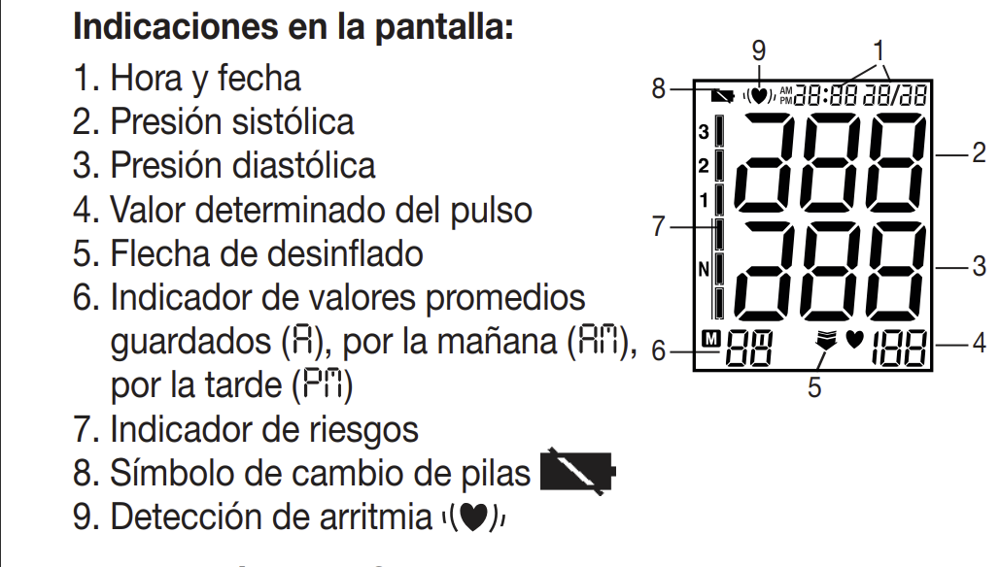
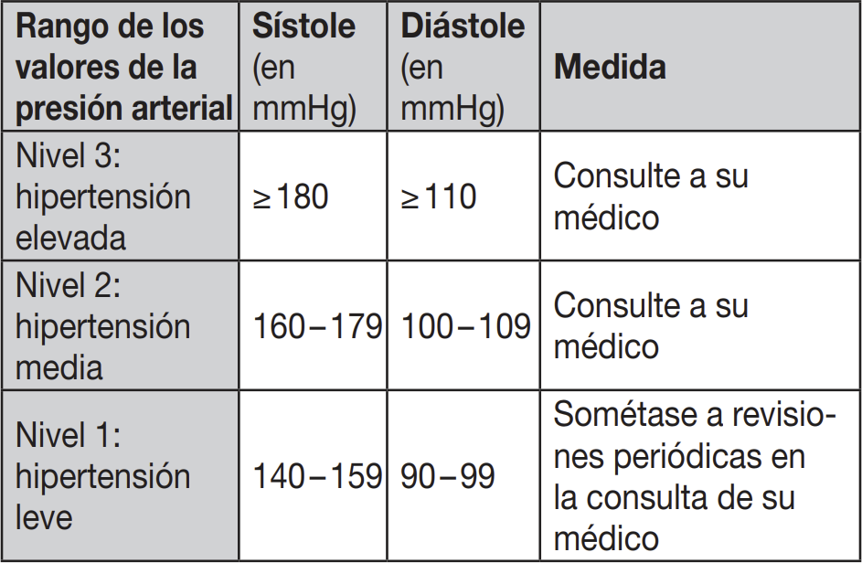
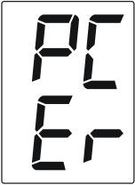
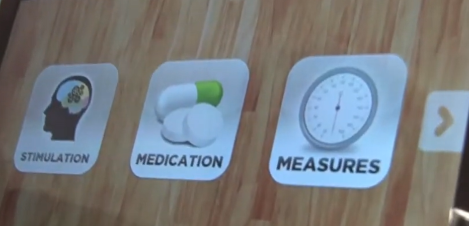
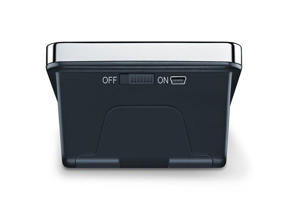

# Beurer BM58 Tentsiometroaren Erabilpen Eskuliburua

Gida honen helburua **Beurer BM58** tentsiometroaren oinarrizko erabilpena eta **GOsasun** aplikazioarekiko konexioa era errazean azaltzea da. Jarraitu beheko urratsak gailua behar bezala erabiltzeko.

---

## 1. Memoria modua: Datuak ikusi eta ezabatu (Erreseteatu)

Tentsiometroak bi erabiltzaile ezberdinen datuak gordetzeko gaitasuna du (**U1** eta **U2**).

### Gordetako datuak ikusteko:

1. Gailua itzalita edo egonean dagoela, ukitu pantailako **MEM** botoia.
2. Pantailan azken aldian erabilitako erabiltzailearen (U1 edo U2) gordetako neurketen batezbestekoa agertuko da.
3. Erabiltzailez aldatu nahi baduzu, ukitu pizteko/itzaltzeko botoia (**START/STOP**) edo erabiltzailearen ikonoa.
4. Ukitu **MEM** botoia berriro ere neurketak banan-banan ikusteko.

### Memoria zerotik hasteko (Erreseteatu):

1. Sartu garbitu nahi duzun erabiltzailearen memorian (**U1** edo **U2**).
2. Datu bat pantailan ikusten ari zarenean, eduki sakatuta **MEM** botoia 3-5 segundoz.
3. Pantailan **"CLR"** hizkiak agertuko dira, memoria garbitu dela adieraziz.

---

## 2. Neurketa modua: Nola hartu tentsioa

Neurketa fidagarria lortzeko, garrantzitsua da lasai egotea eta besokoa (mahuka) ondo jartzea.

### Pausoak:

- **Prestaketa:** Eseri aulki batean bizkarra ondo bermatuta. Besokoa ezkerreko besoan jarri, ukondotik 2-3 zentimetro gorago.
- **Jarrera:** Jarri besoa mahai baten gainean, besokoa bihotzaren parean egon dadin. Ez hitz egin eta ez mugitu.
- **Piztu eta neurtu:** Ukitu **START/STOP** botoia. Gailua automatikoki puzten hasiko da.
- **Emaitza:** Pantailan hiru datu agertuko dira: Presio Sistolikoa, Presio Diastolikoa eta Pultsua.

---

## 3. Ordenagailura konektatzea (USB bidez)

Zure neurketak ordenagailura pasatzeko, tentsiometroa PC-arekin komunikatu behar da.

1. Hartu USB kablea eta konektatu tentsiometroa ordenagailura.
2. Konektatu bezain laster, tentsiometroaren pantailan **"PC"** hizkiak agertu behar dira.

3. **Arazoak?** Pantailan ez bada "PC" agertzen, saiatu **START/STOP** botoia sakatuta mantentzen edo kendu pilak une batez eta jarri berriro.

---

## 4. Datuen inportazioa GOsasun aplikazioan

Tentsiometroa konektatuta dagoenean, datuak deskargatzeko prest zaude.

1. Ireki **GOsasun** aplikazioa zure ordenagailuan.
2. Joan "Neurketak" edo "Measures" atalera.
3. Sakatu **"Datuak inportatu"** edo **"Irakurri tentsiometroa"** botoia.
4. Aplikazioak automatikoki deskargatuko ditu U1 zein U2 memorietako datuak.

---

## 5. GOsasun Aplikazioaren instalazioa

Aplikazioa USB batean jasoko duzu. Hona hemen instalazioa modu egokian egiteko pausoak:

### 1. urratsa: Driverra instalatzea (SOILIK 1. ALDIAN)

Tentsiometroak ordenagailuarekin hitz egin ahal izateko, **Prolific PL-2303** driverra behar da.

- USB barruan, bilatu `PL2303_DriverInstaller.exe` fitxategia.
- Egin klik bikoitza eta jarraitu argibideak (sakatu "Next" instalazio-morroian).

### 2. urratsa: Aplikazioa kopiatzea

- Kopiatu USBko `GOsasun_app` karpeta zure ordenagailuko leku seguru batean (adibidez, Mahaigainean edo Dokumentuetan).

### 3. urratsa: Aplikazioa martxan jartzea

- Sartu karpeta barruan eta bilatu **`GOsasun_app.exe`** ikonoa.
- Egin klik bikoitza aplikazioa irekitzeko. Ez du instalazio gehiagorik behar, zuzenean exekutatzen da.

> [!TIP]
> Tentsiometroa konektatzerakoan ordenagailuak ez badu ezagutzen, ziurtatu driverra (1. urratsa) ondo instalatu duzula.
