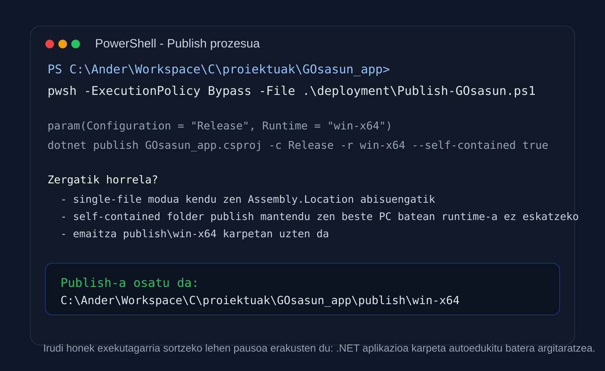
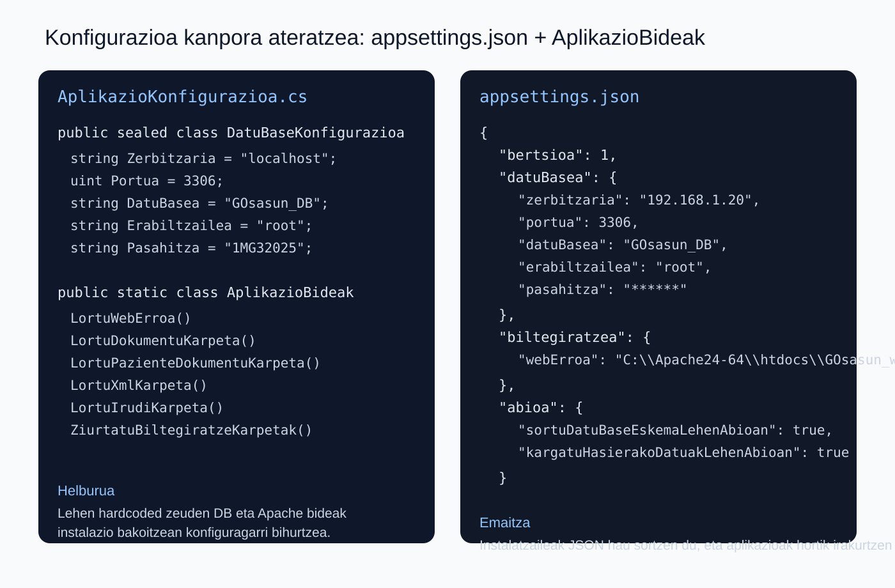
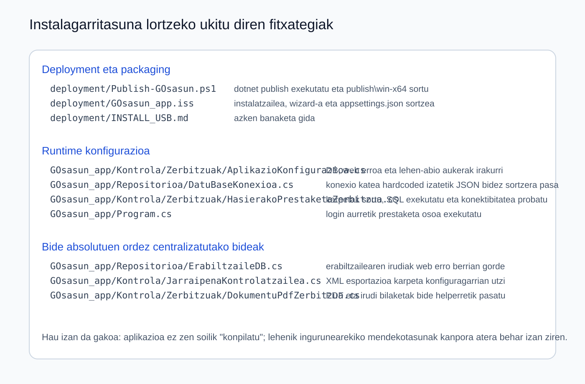
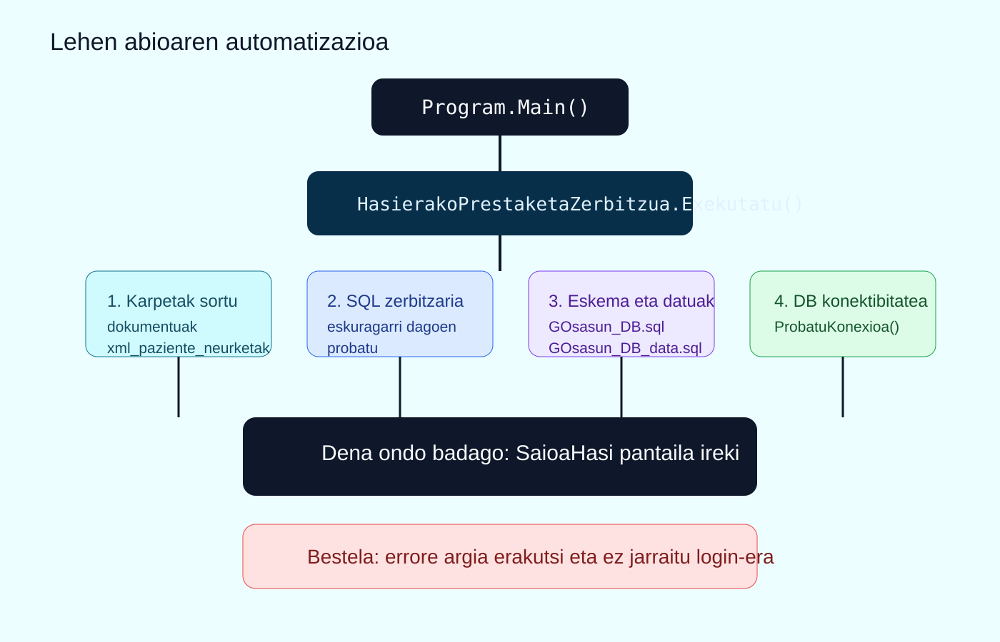
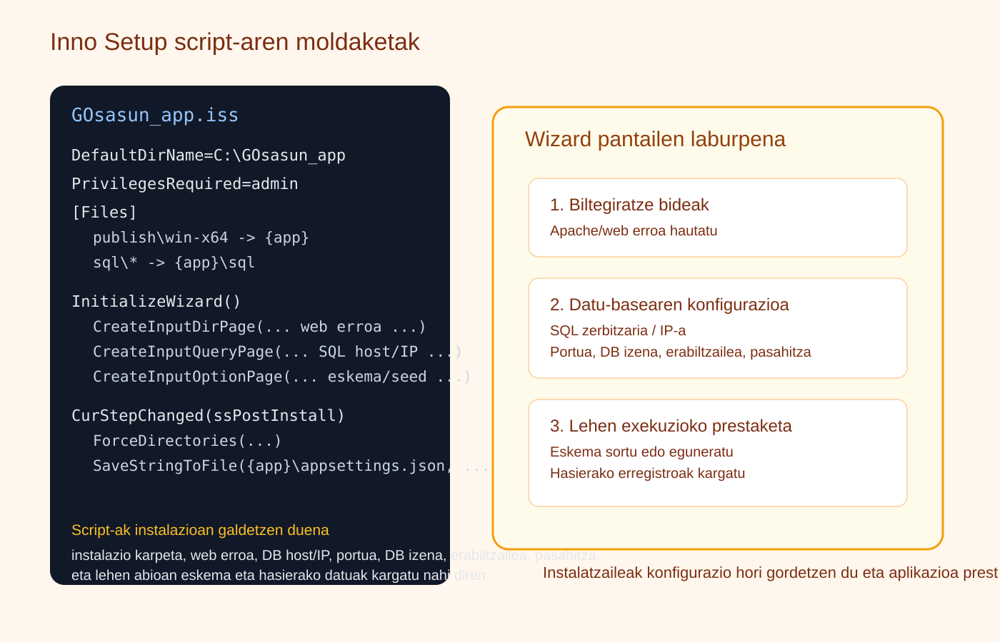
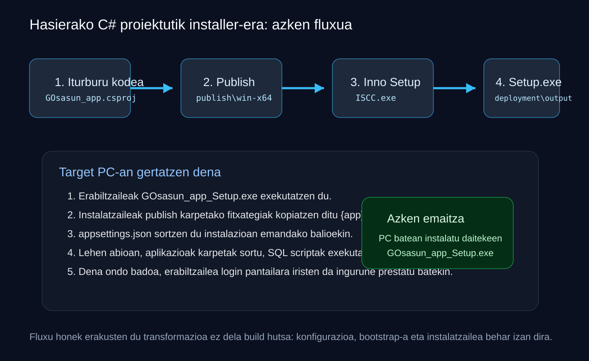

# C# aplikazioa exekutagarri eta instalagarri bihurtzeko prozesua

Dokumentu honek azaltzen du nola bihurtu den GOsasun aplikazioa garapeneko C# WinForms proiektu hutsetik beste ordenagailu batean instalatu daitekeen exekutagarri batean. Helburua ez zen bakarrik `exe` bat sortzea, baizik eta aplikazioa instalazio errealean martxan geratzeko behar zituen mendekotasun guztiak prest uztea: runtime-a, datu-basearen konfigurazioa, web/Apache bideak, lehen abioan exekutatu beharreko SQL script-ak eta instalatzaile gidatua.

## Azaleko fitxa

- Proiektua: `GOsasun_app`
- Teknologia: `.NET WinForms` + `MySQL` + `Inno Setup`
- Helburua: beste Windows ordenagailu batean instalatu daitekeen pakete autoedukia sortzea
- Azken emaitza: `deployment\output\GOsasun_app_Setup.exe`

Jarraian dauden irudiak pantailazo tekniko moduan sortu dira. Prozesuan benetan erabili diren komando, fitxategi eta kode zatietan oinarrituta daude.

## 1. Hasierako egoera eta arazo nagusia

Hasierako proiektua Visual Studio-n edo `dotnet run` bidez exekutatzeko pentsatuta zegoen, baina ez beste ordenagailu batean instalatzeko. Arazo nagusiak hauek ziren:

- datu-basearen konexioaren balioak kodean bertan zeuden hardcoded
- Apache/web bide absolutuak kodean zeuden jarrita
- lehen exekuzioan ez zegoen egiaztapen edo bootstrap prozesurik
- ez zegoen instalatzaile gidaturik
- publish prozesua ez zegoen dokumentatuta edo automatizatuta

Horregatik, lana lau bloketan banatu zen:

1. exekutagarria sortzea
2. konfigurazioa kode barrutik kanpora ateratzea
3. lehen abioa automatizatzea
4. instalatzaile bat sortzea

## 2. `dotnet publish` bidez exekutagarria sortzea

Lehen pausoa aplikazioaren argitalpen autoedukitua prestatzea izan zen. Horretarako sortu eta doitu zen [deployment/Publish-GOsasun.ps1](./Publish-GOsasun.ps1) script-a.



Script honen helburua hau da:

- proiektua `Release` moduan konpilatzea
- `win-x64` helbururako prestatzea
- `--self-contained true` aukerarekin Windows helburuko makinan .NET SDK edo runtime instalatuta ez egotea onartzea
- emaitza [publish/win-x64](../publish/win-x64) karpetan uztea

Erabilitako komandoa:

```powershell
pwsh -ExecutionPolicy Bypass -File .\deployment\Publish-GOsasun.ps1
```

### Zergatik ez single-file modua?

Hasieran publish bakar-fitxategi moduan egitea aztertu zen, baina horrek `Assembly.Location` motako abisuak sortzen zituen. Proiektuak baliabideak eta bideak fitxategi-sistemaren arabera erabiltzen zituenez, fidagarriagoa zen karpeta autoedukitu bat sortzea. Horregatik, azken erabakia hau izan zen:

- `single-file` kendu
- `self-contained folder publish` mantendu

Horrela, [publish/win-x64](../publish/win-x64) karpetan geratu ziren `GOsasun_app.exe`, DLL guztiak, irudiak eta gainontzeko baliabideak.

## 3. Konfigurazioa kode barrutik ateratzea

Exekutagarria sortzea ez zen nahikoa. Aplikazioak instalazio bakoitzean balio desberdinak behar zituen:

- SQL zerbitzariaren IP edo hostname-a
- portua
- datu-basearen izena
- erabiltzailea eta pasahitza
- dokumentu, XML eta irudien web erroa

Horregatik sortu zen [GOsasun_app/Kontrola/Zerbitzuak/AplikazioKonfigurazioa.cs](../GOsasun_app/Kontrola/Zerbitzuak/AplikazioKonfigurazioa.cs).



Fitxategi horrek hiru ideia garrantzitsu ekarri zituen:

### 3.1. `appsettings.json` fitxategia

Instalazio bakoitzean sortzen den JSON fitxategi bat definitu zen. Bertan gordetzen dira:

- `datuBasea`
- `biltegiratzea`
- `abioa`

Horri esker, aplikazioaren exekutagarria bera berdina izan daiteke, baina instalazio bakoitzak bere konfigurazioa izan dezake.

### 3.2. `AplikazioKonfigurazioaHornitzailea`

Klase honek konfigurazioa diskoan irakurri eta idazten du. Bere eginkizunak dira:

- `appsettings.json` existitzen ez bada lehenetsitako konfigurazioa sortzea
- konfigurazioa normalizatzea
- cache txiki bat mantentzea
- fitxategia diskoan gordetzea

### 3.3. `AplikazioBideak`

Lehen zeuden bide absolutu sakabanatuak helper bakar batera eraman ziren. Horri esker, kodeko beste atalak ez dira gehiago `C:\Apache24-64\htdocs\...` bezalako kate finkoetan oinarritzen.

Helper honek kalkulatzen ditu:

- dokumentuen karpeta
- pazienteen dokumentuen karpeta
- XML esportazioen karpeta
- irudien karpeta

## 4. Datu-basearen konexioa konfiguragarri bihurtzea

Hurrengo urratsa izan zen [GOsasun_app/Repositorioa/DatuBaseKonexioa.cs](../GOsasun_app/Repositorioa/DatuBaseKonexioa.cs) egokitzea.

Lehen:

- `localhost`
- `3306`
- `GOsasun_DB`
- `root`
- pasahitza

balio guztiak kodean bertan finkatuta zeuden.

Orain fitxategi horrek `AplikazioKonfigurazioaHornitzailea`-tik irakurtzen ditu balioak, eta `MySqlConnectionStringBuilder` bidez eraikitzen du konexio-katea. Horrek bi onura ekarri zituen:

1. instalatzaileak erabiltzaileari galdetu diezaioke zerbitzariaren IP-a
2. aplikazioa ez dago garapen-ingurune bakar batera lotuta

Gainera, `LortuKonexioa(bool datuBasearekin = true)` gehitu zen, hasierako bootstrap-ean zerbitzaria probatzeko datu-base zehatzik gabe konektatu ahal izateko.

## 5. Bide absolutuak kentzea: PDF, XML eta irudiak

Konfigurazioa sortzea ez zen nahikoa. Ondoren, aplikazioak bide horiek benetan erabiltzen zituen lekuak egokitu behar izan ziren.

Horretarako moldatu ziren fitxategi hauek:

- [GOsasun_app/Repositorioa/ErabiltzaileDB.cs](../GOsasun_app/Repositorioa/ErabiltzaileDB.cs)
- [GOsasun_app/Kontrola/JarraipenaKontrolatzailea.cs](../GOsasun_app/Kontrola/JarraipenaKontrolatzailea.cs)
- [GOsasun_app/Kontrola/Zerbitzuak/DokumentuPdfZerbitzua.cs](../GOsasun_app/Kontrola/Zerbitzuak/DokumentuPdfZerbitzua.cs)



### 5.1. Erabiltzaileen irudiak

Erabiltzaileen argazkiak gordetzeko logika `AplikazioBideak.LortuIrudiHelmugaBidea(...)` metodoaren mende utzi zen. Horrek esan nahi du helmugako karpeta instalazioaren web erroaren arabera kalkulatzen dela.

### 5.2. XML esportazioa

Jarraipenaren XML esportazioa lehen bide absolutu batera joaten zen. Orain `AplikazioBideak.LortuXmlKarpeta()` erabiltzen da, eta karpeta ez badago automatikoki sortzen da.

### 5.3. PDF dokumentuak eta irudien bilaketa

PDF zerbitzuak pazienteen dokumentuak eta irudiak bilatzeko erabiltzen zituen erroak ere helper zentralizatuetara pasa ziren. Horrela, instalatutako aplikazioak ez du garapeneko irudi-erro jakin baten beharrik.

## 6. Lehen abioa automatizatzea

Instalatutako aplikazio batek ezin du suposatu ingurunea dagoeneko prestatuta dagoela. Horregatik sortu zen [GOsasun_app/Kontrola/Zerbitzuak/HasierakoPrestaketaZerbitzua.cs](../GOsasun_app/Kontrola/Zerbitzuak/HasierakoPrestaketaZerbitzua.cs), eta [GOsasun_app/Program.cs](../GOsasun_app/Program.cs) fitxategian login pantaila ireki aurretik deitu zen.



Prozesu hau exekutatzen da aplikazioa lehen aldiz irekitzean:

1. konfigurazioa irakurri
2. web/Apache karpetak existitzen direla ziurtatu
3. SQL zerbitzaria eskuragarri dagoela probatu
4. beharrezkoa bada eskema sortu edo eguneratu
5. beharrezkoa bada seed datuak kargatu
6. azken DB konexio-proba egin
7. dena ondo badago bakarrik `SaioaHasi` pantaila ireki

### Exekutatzen diren SQL script-ak

Bootstrap zerbitzuak `sql` karpetatik script hauek erabil ditzake:

- [sql/GOsasun_DB.sql](../sql/GOsasun_DB.sql)
- [sql/GOsasun_DB_trigger.sql](../sql/GOsasun_DB_trigger.sql)
- [sql/GOsasun_DB_bistak.sql](../sql/GOsasun_DB_bistak.sql)
- [sql/GOsasun_DB_indizeak.sql](../sql/GOsasun_DB_indizeak.sql)
- [sql/GOsasun_DB_data.sql](../sql/GOsasun_DB_data.sql)

Horrela, aplikazioa lehen exekuzioan bakarrik ez da pizten: bere ingurunea prest uzten du, eta errorea badago erabiltzaileari mezua ematen dio zuzenean.

## 7. Inno Setup bidez instalatzailea sortzea

Exekutagarria edukita eta runtime konfigurazioa eginda, hurrengo pausoa instalatzaile klasiko bat eraikitzea izan zen. Horretarako doitu zen [deployment/GOsasun_app.iss](./GOsasun_app.iss).



Script horrek hainbat eginkizun ditu:

- `publish\win-x64` karpetako edukia `{app}` helburura kopiatu
- `sql` karpetako script-ak instalazioan sartu
- instalazio direktorio lehenetsia proposatu: `C:\GOsasun_app`
- instalazioan zehar galdetu zer web erro erabili behar den
- SQL zerbitzariaren datuak eskatu
- lehen abioan eskema eta seed datuak exekutatu behar diren aukeratu
- amaieran `{app}\appsettings.json` sortu

Gainera, erabiltzailea ez galtzeko, instalazioaren hasieran azalpen-orri bat gehitu zen. Orrialde horrek esaten du zer datu prest izan behar diren:

- instalazio karpeta
- web/Apache erroaren bidea
- SQL zerbitzariaren IP edo hostname-a
- SQL portua, erabiltzailea eta pasahitza
- lehen abioan eskema eta seed datuak kargatu nahi diren ala ez

### Script-eko atal garrantzitsuenak

#### `InitializeWizard()`

Hemen definitzen dira wizard-eko orriak:

- azalpen orri bat instalazioa hasi aurretik
- `CreateInputDirPage` web erroarentzat
- `CreateInputQueryPage` datu-basearen balioentzat
- `CreateInputOptionPage` lehen abio aukerentzat

#### `CurStepChanged(ssPostInstall)`

Instalazioa amaitutakoan:

- helmugako karpetak sortzen ditu
- `appsettings.json` gordetzen du

Horrek lotzen ditu instalazioan erabiltzaileak emandako balioak eta exekutatzean aplikazioak irakurriko duen konfigurazioa.

### Akats praktiko bat eta konponketa

Instalatzailearen bertsio zahar batek exekuzioan `publish\win-x64` karpeta bilatzen zuen, eta horrek helburuko ordenagailuan errore hau eragiten zuen:

`Ez da publish karpeta aurkitu. Lehenik exekutatu deployment\Publish-GOsasun.ps1 script-a.`

Hori ez zen zuzena, `Publish-GOsasun.ps1` script-a garapeneko makinan bakarrik exekutatu behar delako, ez instalazioa jasotzen duen ordenagailuan. Horregatik egin zen azken zuzenketa hau:

- runtime-ko egiaztapen hori kendu
- azalpen orri argi bat gehitu instalatzailearen hasieran

Ondorioz, erabiltzaile arruntak `Setup.exe` exekutatu besterik ez du egin behar.

## 8. Helburuko ordenagailuan zer egin behar da instalatzeko

Atal hau da erabiltzaile finalak jarraitu behar duena.

1. USBa edo instalatzailea duen karpeta ireki.
2. Exekutatu [deployment/output/GOsasun_app_Setup.exe](./output/GOsasun_app_Setup.exe) administratzaile gisa.
3. Irakurri lehen azalpen-orria eta prest eduki SQL eta web erroaren datuak.
4. Aukeratu instalazio karpeta.
5. Idatzi web/Apache erroaren bidea.
6. Idatzi SQL host/IP-a, portua, datu-basearen izena, erabiltzailea eta pasahitza.
7. Ingurune berria bada, aktibatu lehen abioan eskema eta hasierako datuak kargatzeko aukerak.
8. Amaitu instalazioa eta ireki aplikazioa.
9. Lehen abioan, aplikazioak karpetak sortu, SQL script-ak exekutatu eta DB konexioa egiaztatuko ditu.

### Gomendio praktikoa

Instalazioa ingurune berri batean egiten bada, normalean aukerarik seguruena hau da:

- eskema sortu edo eguneratu: `Bai`
- hasierako datuak kargatu: `Bai`

## 9. Azken emaitza: `Setup.exe`

Inno Setup konpilatzean lortzen den azken fitxategia hau da:

- [deployment/output/GOsasun_app_Setup.exe](./output/GOsasun_app_Setup.exe)

Konpilazio kate osoa honela geratu zen:



Praktikan, azken banaketa honela egiten da:

1. `Publish-GOsasun.ps1` exekutatu
2. `GOsasun_app.iss` konpilatu `ISCC.exe`-rekin
3. `GOsasun_app_Setup.exe` sortu
4. instalatzailea USB edo beste banaketa-bide batera kopiatu

## 10. Laburpena: egin diren moldaketa guztiak

Transformazio hau lortzeko ez da nahikoa izan proiektua konpilatzea. Egin diren moldaketa nagusiak hauek izan dira:

1. publish prozesua automatizatu
2. single-file modua baztertu eta karpeta autoedukitua erabili
3. DB eta biltegiratze bideak `appsettings.json`-era atera
4. bide absolutu sakabanatuak helper zentral batean batu
5. datu-basearen konexioa konfiguragarri bihurtu
6. lehen abioan bootstrap automatikoa gehitu
7. SQL eskema eta hasierako datuak exekutatzeko aukera gehitu
8. Inno Setup instalatzaile gidatua prestatu
9. instalazio ondoren `appsettings.json` automatikoki sortzea gehitu

## 11. Ondorioa

Beraz, C# WinForms proiektu hau exekutagarri eta instalagarri bihurtzeko egin den benetako lana hiru mailatan ulertu behar da:

- build mailan: `dotnet publish`
- konfigurazio mailan: `appsettings.json` eta bide helper-ak
- deployment mailan: Inno Setup + lehen-abio bootstrap-a

Horri esker, gaur egun GOsasun aplikazioa ez da garapeneko makina bakar baterako proiektu bat bakarrik. Beste Windows ordenagailu batean instalatu, konfiguratu eta martxan jar daitekeen aplikazio paketizatua da.

## Entregarako oharra

PDF batera esportatzerakoan, gomendagarria da dokumentu hau atal bakoitzeko irudiekin batera inprimatzea, irudiak orri-zabalera egokian ipinita eta kode-blokeak monoespazio formatuan mantenduta.
