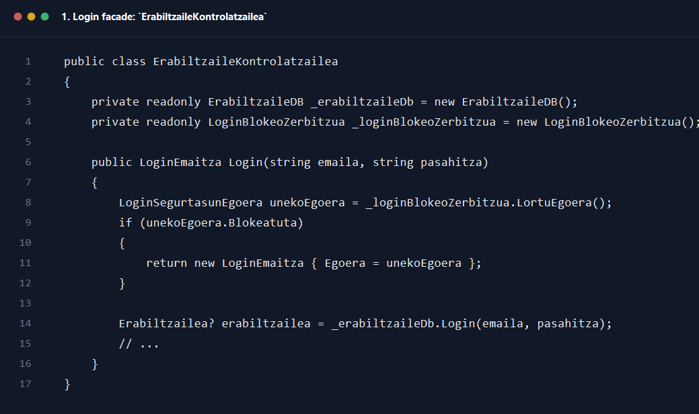
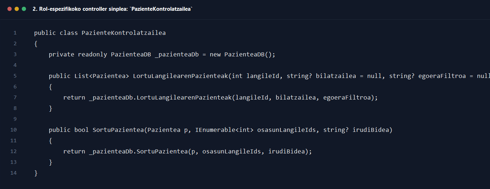
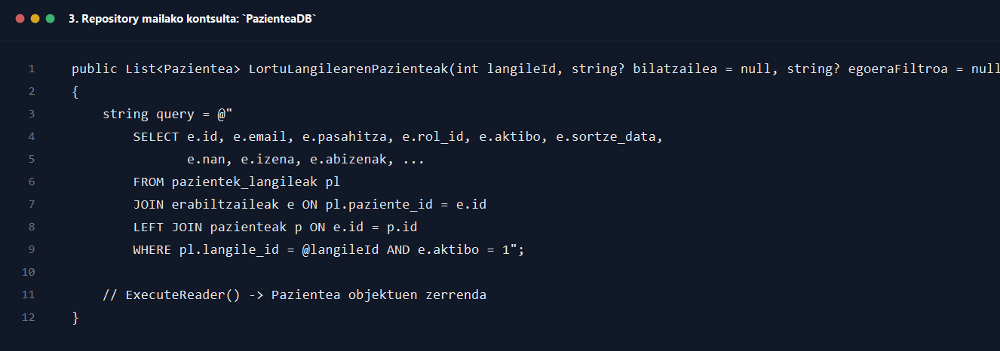
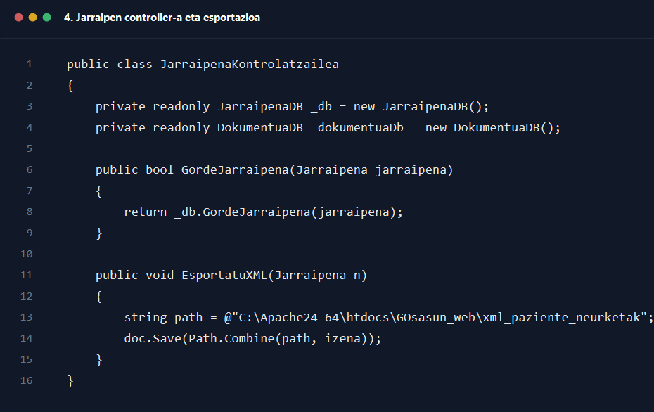
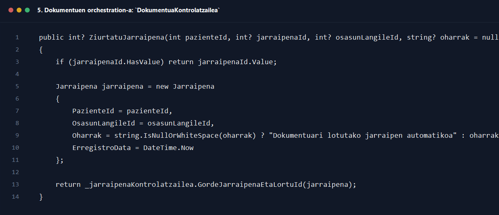
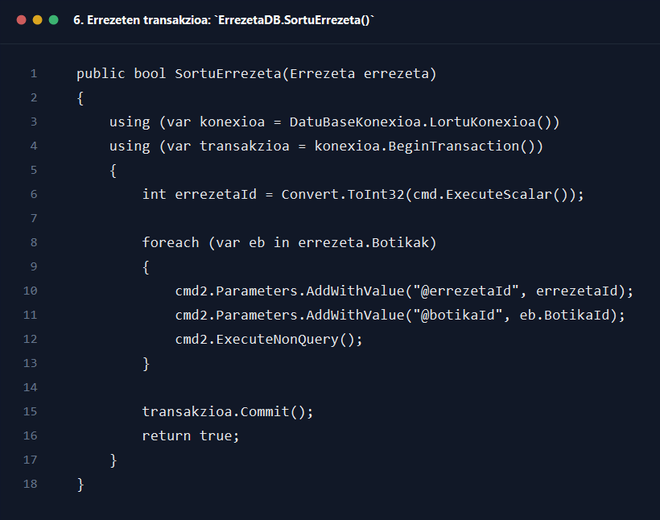

# Kontrola eta repositorioa klase diagrama

## Helburua

Dokumentu honek `kontrola_repositorioa_klase_diagrama.drawio` fitxategian irudikatutako kontrola- eta repository-geruzaren egitura azaltzen du. Helburua da zein klasek negozio-logika koordinatzen duten, zeinek egiten duten persistzentzia, eta zein zerbitzu osagarrik parte hartzen duten argi uztea.

## Ikuspegi orokorra

Diagrama hiru zutabetan antolatuta dago:

- `Kontrola`: UItik datozen ekintzak orkestratzen dituzten kontrolatzaileak
- `Repositorioa`: MySQL-rekin hitz egiten duten DB klaseak
- `Modeloak eta zerbitzu osagarriak`: datu-ereduak eta zerbitzu espezifikoak, hala nola BM58 edo PDF sorkuntza

## UML notazioa

Diagrama honetan erabili den notazioa honakoa da:

- `+` -> eragiketa publikoa
- `{static}` -> metodo edo eragiketa estatikoa
- `izena: mota` -> parametroen mota adierazteko formatua
- `): mota` -> itzulera mota adierazteko formatua

Beraz, metodo estatikoak ez dira `[static]` gisa markatzen, `{static}` gisa baizik. Une honetan diagraman ageri den kasu publikoa `DokumentuPdfZerbitzua.SortuHelmugaBidea(...)` da, eta notazio horrekin dago markatuta.

Arkitektura honen ideia nagusia da formularioek ez dutela SQL zuzenean exekutatzen. UIak controller bati deitzen dio; controller-ak repository bat edo gehiago koordinatzen ditu; eta repository-ak modeloko objektuak beteta itzultzen ditu.

## Kontrola geruzaren azalpena

### 1. Autentifikazio-fachada

`ErabiltzaileKontrolatzailea` gaur egun login-only facade gisa geratu da. Honek esan nahi du aurreko erabiltzaile CRUD orokorra zatitu dela, eta orain saio-hasiera eta segurtasun-blokeoa soilik zentralizatzen dituela.

### 2. Rol espezifikoko kontrolatzaileak

- `PazienteKontrolatzailea` -> pazienteen kontsulta, sorrera, eguneraketa, desaktibazioa eta esleipenak
- `OsasunLangileKontrolatzailea` -> osasun-langileen CRUD-a
- `HarrerakoLangileKontrolatzailea` -> harrerako langileen CRUD-a

Controller split horrek erantzukizunak argiago banatzen ditu eta UI bakoitzak behar duen API zehatza erabiltzea ahalbidetzen du.

### 3. Domeinu funtzionaleko kontrolatzaileak

- `HitzorduKontrolatzailea` -> agenda eta hitzorduen kudeaketa
- `JarraipenaKontrolatzailea` -> neurketen eta jarraipenen kudeaketa
- `DokumentuaKontrolatzailea` -> dokumentuen lotura, txostenak eta jarraipen automatikoak
- `ErrezetaKontrolatzailea` -> errezeten negozio-logika eta persistzentzia orchestration

## Repository geruzaren azalpena

Repository bakoitzak taula edo erlazio multzo jakin baten SQL eragiketak biltzen ditu:

- `ErabiltzaileDB` -> login kontsulta eta rol-ebazpena
- `PazienteaDB` -> pazienteen taula, erabiltzaile taula eta lotura-taulen kontsultak
- `OsasunLangileaDB`, `HarrerakoLangileaDB` -> rol horietako CRUD zehatzak
- `HitzorduDB` -> agenda erregistroak
- `JarraipenaDB` -> neurketak/jarraipenak
- `DokumentuaDB` -> dokumentuen metadata eta bilaketak
- `ErrezetaDB` eta `BotikaDB` -> errezetak, lotura-taula eta botika katalogoa

Repository hauek ez dira view edo formularioen araberakoak; datu-mailako eragiketak eskaintzen dituzte eta modeloko objektuak itzultzen dituzte.

## Zerbitzu osagarriak

### `LoginBlokeoZerbitzua`

Saio-hasierako segurtasun-blokeoaren egoera gordetzen eta kalkulatzen du. Ez da datu-baseko repository bat, baina autentifikazio fluxuaren zati kritikoa da.

### `BM58Driver`

Beurer BM58 gailuarekin komunikatzen da. Honek hardwareko datu gordinak `Jarraipena` objektu bihurtzen ditu, baina persistzentzia ez du zuzenean egiten.

### `DokumentuPdfZerbitzua`

Txostenen PDF bidea kalkulatu edo PDF fitxategiak sortzeko erabiltzen da. `DokumentuaKontrolatzailea`-k erabiltzen du dokumentu-fluxuetan.

## Dependentzia nagusiak

### Controller -> Repository

Diagrama honetan gezi berdeek controller-ek repository edo zerbitzu batera duten dependentzia erakusten dute. Adibidez:

- `PazienteKontrolatzailea` -> `PazienteaDB`
- `ErrezetaKontrolatzailea` -> `ErrezetaDB`
- `JarraipenaKontrolatzailea` -> `JarraipenaDB`
- `DokumentuaKontrolatzailea` -> `DokumentuaDB`, `JarraipenaKontrolatzailea`, `DokumentuPdfZerbitzua`

### Repository -> Modeloak

Gezi urdin edo laranjek erakusten dute repository-ek eta controller-ek modeloko objektuak kontsultatu eta eguneratzen dituztela. Hau funtsezkoa da, izan ere, SQL emaitza guztiak `Pazientea`, `Jarraipena`, `Dokumentua`, `Errezeta` eta antzeko objektuetan materializatzen dira.

## Controller split berriaren garrantzia

Diagrama honek azken refaktorizazio bat islatzen du: `ErabiltzaileKontrolatzailea`-ren erantzukizunak zatitu egin dira. Honek hiru onura praktiko ekarri ditu:

- UI bakoitzak controller egokiagoa erabiltzen du eta ez facade monolitiko bat
- login logika independente eta seguruago geratu da
- diagraman bertan argi ikusten da zein repository erabiltzen duen controller bakoitzak

## Kode pantailazoak

### 1. Login facade: `ErabiltzaileKontrolatzailea`

Iturria: `GOsasun_app/Kontrola/ErabiltzaileKontrolatzailea.cs`

### 2. Rol-espezifikoko controller sinplea: `PazienteKontrolatzailea`

Iturria: `GOsasun_app/Kontrola/PazienteKontrolatzailea.cs`

### 3. Repository mailako kontsulta: `PazienteaDB`

Iturria: `GOsasun_app/Repositorioa/PazienteaDB.cs`

### 4. Jarraipen controller-a eta esportazioa

Iturria: `GOsasun_app/Kontrola/JarraipenaKontrolatzailea.cs`

### 5. Dokumentuen orchestration-a: `DokumentuaKontrolatzailea`

Iturria: `GOsasun_app/Kontrola/DokumentuaKontrolatzailea.cs`

### 6. Errezeten transakzioa: `ErrezetaDB.SortuErrezeta()`

Iturria: `GOsasun_app/Repositorioa/ErrezetaDB.cs`

## Ondorio nagusia

Diagrama honek aplikazioaren exekuzio arkitektura azaltzen du: UI -> Controller -> Repository -> Modeloa/Zerbitzuak. Geruza horien arteko dependentziak ondo ulertuta, errazagoa da fluxu berriak diseinatzea, bug-ak lokalizatzea eta refaktorizazioak modu seguruan egitea.
