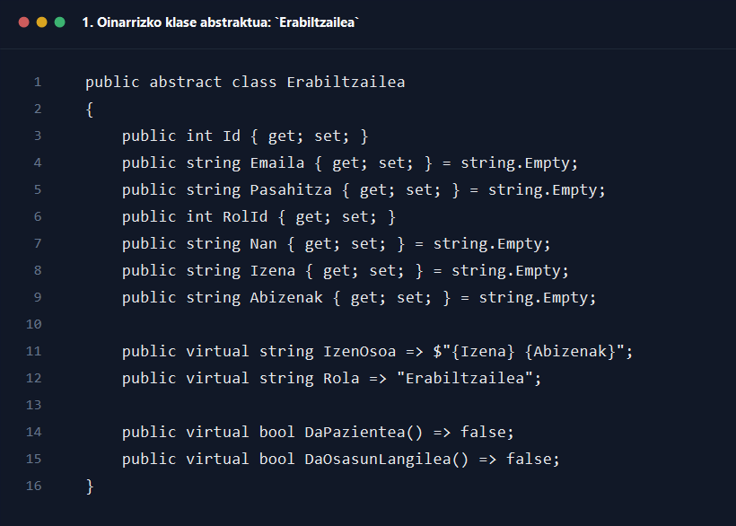
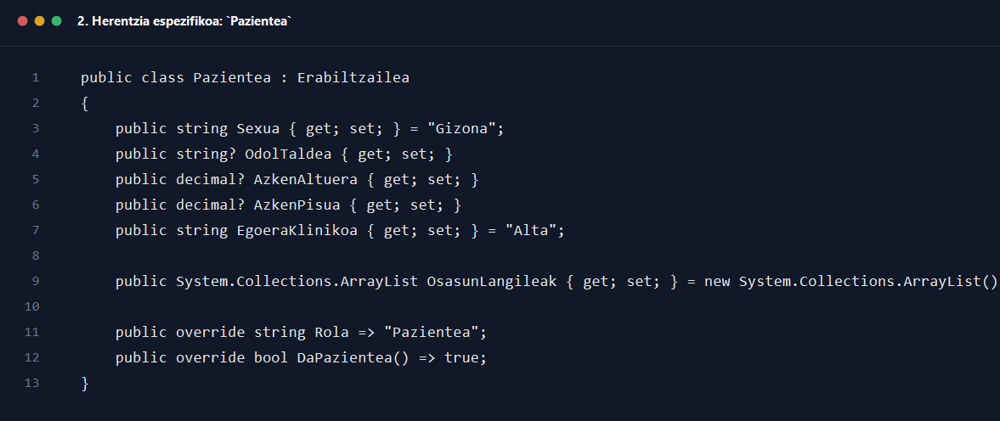
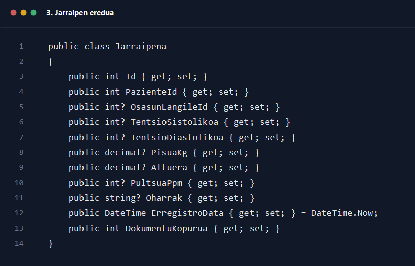
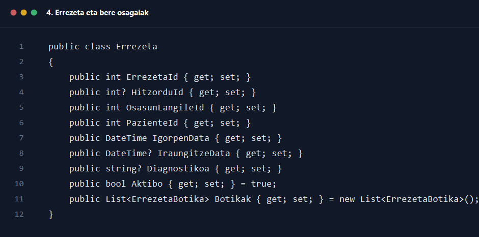
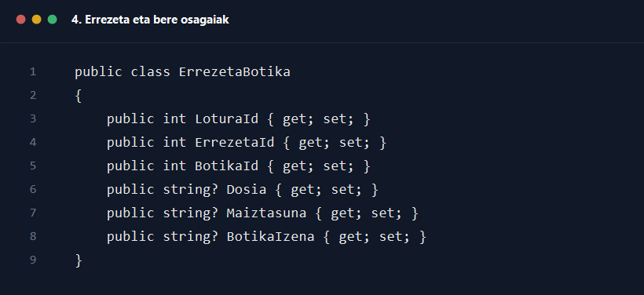

# Modeloa klase diagrama

## Helburua

Dokumentu honek `modeloa_klase_diagrama.drawio` fitxategian agertzen den modelo-geruzaren egitura azaltzen du. Azalpena bi mailatan dago antolatuta: lehenengo ikuspegi orokorra, eta ondoren klase bakoitzaren funtzioa, atributu nagusiak eta erlazio teknikoak.

## Ikuspegi orokorra

Diagrama honek 11 modelo nagusi erakusten ditu, hiru multzotan banatuta:

- Erabiltzaile familia: `Erabiltzailea`, `Pazientea`, `OsasunLangilea`, `HarrerakoLangilea`, `Rola`
- Jarraipen eta dokumentazio eredua: `Jarraipena`, `Dokumentua`
- Hitzordu eta errezeta eredua: `Hitzordua`, `Errezeta`, `ErrezetaBotika`, `Botika`

## UML notazioa

Diagrama honetan erabili den notazioa honakoa da:

- `-` -> atributu pribatua
- `+` -> eragiketa publikoa
- `{static}` -> metodo edo eragiketa estatikoa

Modeloko diagraman ez dago eragiketa estatikorik irudikatuta; hala ere, notazioa bateratuta geratzen da gainerako diagramarekin.

Arkitekturaren ikuspegitik, modelo hauek dira aplikazio osoan zehar partekatzen diren datu-egiturak. Kontrolatzaileek eta repository-ek objektu horiek sortu, bete, kontsultatu eta eguneratzen dituzte. Horregatik, diagrama honek ez du UI logikarik edo SQL logikarik erakusten; datuen forma eta klaseen arteko erlazioak baizik.

## Erabiltzaile familiaren azalpena

`Erabiltzailea` klase abstraktuak sistemako erabiltzaile guztien oinarrizko datuak zentralizatzen ditu: identitatea, login datuak, profilaren oinarrizko informazioa eta hizkuntza. `Pazientea`, `OsasunLangilea` eta `HarrerakoLangilea` klaseek herentziaz jasotzen dute egitura hori eta bakoitzak bere eremu espezifikoak gehitzen ditu.

### Herentzia egitura

- `Pazientea` -> datu kliniko oinarrizkoak: sexua, odol-taldea, azken altuera, azken pisua eta egoera klinikoa
- `OsasunLangilea` -> jardun profesionaleko datuak: elkargokide zenbakia, espezialitatea, kontsulta eta lanaldia
- `HarrerakoLangilea` -> txandaren informazioa

### Rola klasearen zeregina

`Rola` klaseak `rolak` taulako balio tipologikoak adierazten ditu. Diagraman `Erabiltzailea 0..* - Rola 1` erlazioa ageri da: erabiltzaile bakoitzak rol bakarra du, baina rol bera erabiltzaile askok parteka dezakete.

## Jarraipen eta dokumentazio eredua

`Jarraipena` klaseak paziente baten neurketa edo ohar erregistro bat ordezkatzen du. Tentsio, pisu, altuera eta pultsu eremuak aukerazkoak dira, eta horrek adierazten du erregistro guztiek ez dutela zertan datu kliniko mota bera izan. `Dokumentua` klaseak fitxategi baten metadata gordetzen du, eta `Jarraipena 1 - Dokumentua 0..*` erlazioak dokumentu asko lotu daitezkeela jarraipen bakar batera erakusten du.

Gainera, dokumentuek pazientearekiko erlazio zuzena ere badute, dokumentu baten testuingurua ez galtzeko. Horregatik `Dokumentua` klaseak `PazienteId`, `PazienteNan`, `PazienteIzena` eta `PazienteAbizenak` bezalako datuak ere baditu.

## Hitzordu eta errezeta eredua

`Hitzordua` klaseak agenda mailako entitatea adierazten du: pazientea, osasun-langilea, eguna, ordua, arrazoia eta egoera. `Errezeta` klaseak, berriz, mediku-preskripzioaren goi mailako erregistroa gordetzen du, eta paziente bati zein osasun-langilek eman dion lotzen du.

`ErrezetaBotika` lotura-klaseak `Errezeta` eta `Botika` klaseen arteko konposizioa modelatzen du. Hau garrantzitsua da, botika bera errezeta askotan erabil daitekeelako, baina errezeta bakoitzean dosi eta maiztasun propioekin.

## Erlazio nagusiak xehetasunez

### 1. Herentzia

- `Pazientea`, `OsasunLangilea` eta `HarrerakoLangilea` klaseek `Erabiltzailea`-tik heredatzen dute.
- Honek esan nahi du autentifikazio, NAN, izena edo helbidea bezalako datu komunak ez direla bikoizten.

### 2. Pazientea eta osasun-langilea

- Diagraman `asoziazio bidirekzionala [0..* - 0..*]` gisa marraztuta dago.
- Praktikan, paziente batek osasun-langile bat edo gehiago izan ditzake, eta osasun-langile batek paziente asko.

### 3. Pazientea eta jarraipenak

- Paziente bakoitzak `0..*` jarraipen izan ditzake.
- Jarraipen bakoitza paziente bakar bati lotuta dago `PazienteId` bidez.

### 4. Jarraipena eta dokumentuak

- Jarraipen bakoitzak dokumentu asko izan ditzake.
- Dokumentu bakoitzak `JarraipenaId` bakarra dauka.

### 5. Pazientea, hitzordua eta errezeta

- Paziente batek hitzordu asko izan ditzake.
- Paziente batek errezeta asko izan ditzake.
- Errezeta batek hitzordu batekin lotura aukerakoa izan dezake (`0..1`).

### 6. Errezeta eta botikak

- `Errezeta 1 - ErrezetaBotika 1..*` konposizioak adierazten du `ErrezetaBotika` elementuak errezetaren parte direla.
- `Botika 1 - ErrezetaBotika 0..*` erlazioak botika katalogoko elementu bat errezeta askotan berrerabili daitekeela adierazten du.

## Kode pantailazoak

### 1. Oinarrizko klase abstraktua: `Erabiltzailea`

Iturria: `GOsasun_app/Modeloa/Erabiltzailea.cs`

### 2. Herentzia espezifikoa: `Pazientea`

Iturria: `GOsasun_app/Modeloa/Pazientea.cs`

### 3. Jarraipen eredua

Iturria: `GOsasun_app/Modeloa/Jarraipena.cs`

### 4. Errezeta eta bere osagaiak

Iturria: `GOsasun_app/Modeloa/Errezeta.cs`

Iturria: `GOsasun_app/Modeloa/ErrezetaBotika.cs`

## Ondorio nagusia

Modeloko diagrama honek aplikazioaren hiztegi semantikoa definitzen du. Gainerako geruza guztiek hemen definitutako klase eta erlazio berdinak erabiltzen dituzte; horregatik, diagrama hau ondo ulertzea ezinbestekoa da controller, repository eta UI fluxuak ulertzeko.
