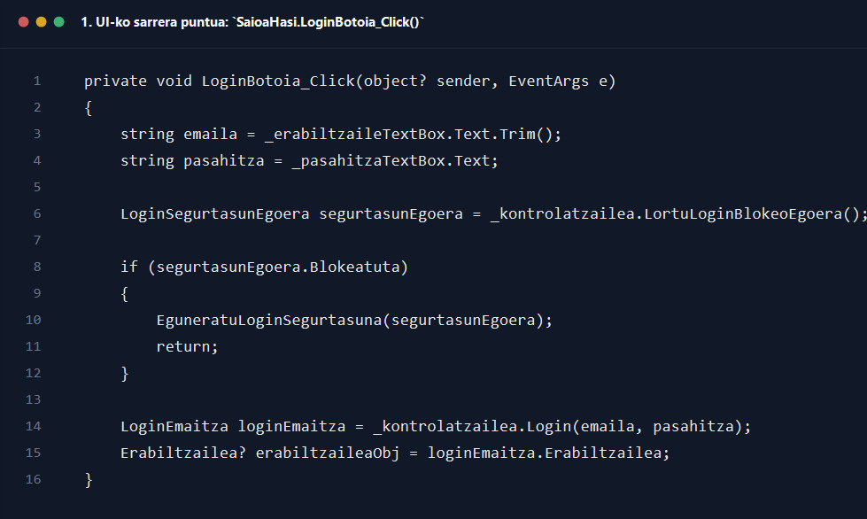
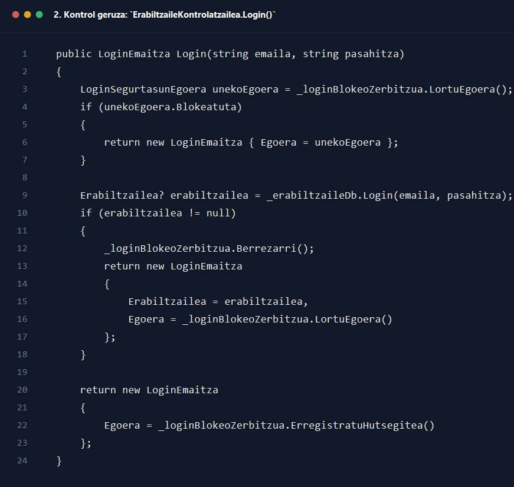
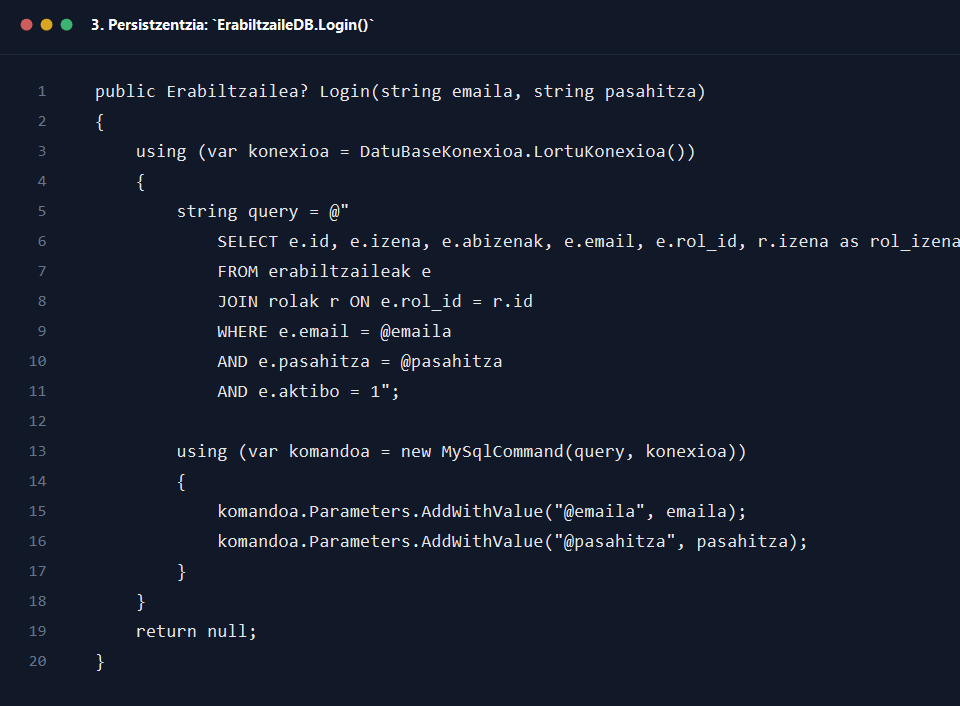

# 1. Osasun langilea saioa hasi

## Helburua

Dokumentu honek `1_osasun_langilea_saioa_hasi.drawio` sekuentzia-diagramaren prozesu osoa azaltzen du, erabiltzaileak saio-hasierako interfazea erabiltzen duen unetik sistemak rol egokia duen menua ireki arte.

## Parte-hartzaile nagusiak

- Erabiltzailea
- `Interfazea/SaioaHasi.cs`
- `Kontrola/ErabiltzaileKontrolatzailea.cs`
- `Kontrola/Zerbitzuak/LoginBlokeoZerbitzua.cs`
- `Repositorioa/ErabiltzaileDB.cs`
- `MenuaOsasunLangilea`, `PazienteMenua` edo `HarreraMenua`

## Fluxu nagusia pausoz pauso

1. Erabiltzaileak saioa hasteko pantaila irekitzen du eta `SaioaHasi` formularioaren konstruktorea exekutatzen da.
2. Konstruktorean `_kontrolatzailea = new ErabiltzaileKontrolatzailea()` sortzen da, `KonfiguratuFormularioa()`, `KargatuBaliabideak()`, `KonfiguratuGertakariak()` eta `EguneratuLoginSegurtasuna()` deitzen dira.
3. `EguneratuLoginSegurtasuna()` metodoak `_kontrolatzailea.LortuLoginBlokeoEgoera()` deitzen du.
4. `ErabiltzaileKontrolatzailea.LortuLoginBlokeoEgoera()` metodoak `_loginBlokeoZerbitzua.LortuEgoera()` deitzen du.
5. `LoginBlokeoZerbitzua.LortuEgoera()` metodoak JSON fitxategiko egoera kargatzen du, normalizatzen du eta `LoginSegurtasunEgoera` itzultzen du.
6. Interfazeak itzulitako egoera erabiliz login botoia eta testu-koadroak aktibatu edo desaktibatzen ditu.
7. Erabiltzaileak emaila eta pasahitza sartzen ditu eta `_loginBotoia` sakatzen du; horrek `LoginBotoia_Click()` exekutatzen du.
8. `LoginBotoia_Click()` metodoak `_kontrolatzailea.LortuLoginBlokeoEgoera()` berriz deitzen du, blokeoa indarrean dagoen ala ez egiaztatzeko.
9. Egoera blokeatuta badago, `EguneratuLoginSegurtasuna(segurtasunEgoera)` deitzen da eta fluxua hemen amaitzen da, autentifikaziorik egin gabe.
10. Emaila edo pasahitza hutsik badaude, `ErakutsiMezua("Mesedez, sartu emaila eta pasahitza.", ...)` exekutatzen da eta ez da kontrolatzailera pasatzen.
11. Datuak badira, `LoginBotoia_Click()` metodoak `_kontrolatzailea.Login(emaila, pasahitza)` deitzen du.
12. `ErabiltzaileKontrolatzailea.Login()` metodoak lehenengo `_loginBlokeoZerbitzua.LortuEgoera()` deitzen du eta blokeoa badago `new LoginEmaitza { Egoera = unekoEgoera }` itzultzen du.
13. Blokeorik ez badago, `_erabiltzaileDb.Login(emaila, pasahitza)` deitzen du.
14. `ErabiltzaileDB.Login()` metodoak MySQL query hau exekutatzen du kontzeptualki: `erabiltzaileak` eta `rolak` taulak elkartu, emaila, pasahitza eta `aktibo = 1` baldintzekin filtratu.
15. DBn erregistro bat aurkitzen bada, `rol_id` eta `rol_izena` arabera objektu konkretu bat sortzen du: `Pazientea`, `OsasunLangilea` edo `HarrerakoLangilea`.
16. `ErabiltzaileDB.Login()` metodoak `Erabiltzailea?` itzultzen du. Balio posibleak hauek dira: erabiltzaile objektu baliozkoa edo `null`.
17. Erabiltzailea aurkitzen bada, `ErabiltzaileKontrolatzailea.Login()` metodoak `_loginBlokeoZerbitzua.Berrezarri()` deitzen du, aurreko hutsegiteen egoera garbitzeko.
18. Ondoren `new LoginEmaitza { Erabiltzailea = erabiltzailea, Egoera = _loginBlokeoZerbitzua.LortuEgoera() }` itzultzen du.
19. Erabiltzailea aurkitzen ez bada, `_loginBlokeoZerbitzua.ErregistratuHutsegitea()` deitzen du.
20. `LoginBlokeoZerbitzua.ErregistratuHutsegitea()` metodoak saiakera kopurua eguneratzen du, beharrezkoa bada 8 orduko blokeoa aktibatzen du, egoera diskoan gordetzen du eta `LoginSegurtasunEgoera` berria itzultzen du.
21. `ErabiltzaileKontrolatzailea.Login()` metodoak kasu horretan `new LoginEmaitza { Egoera = ... }` itzultzen du, `Erabiltzailea = null` utzita.
22. Interfazera bueltatuta, `LoginBotoia_Click()` metodoak `loginEmaitza.Erabiltzailea` aztertzen du.
23. Erabiltzailea baliozkoa bada, `_blokeoEguneratzeTimerra.Stop()` egiten da eta `IrekiMenuNagusia(() => SortuMenuNagusia(erabiltzaileaObj))` deitzen da.
24. `SortuMenuNagusia()` metodoak erabiltzaile motaren arabera formulario egokia itzultzen du: `MenuaOsasunLangilea`, `PazienteMenua` edo `HarreraMenua`.
25. `IrekiMenuNagusia()` metodoak formulario berria sortu, erakutsi eta uneko login formularioa ezkutatzen du.
26. Menua ixten denean, `FormClosed` gertakariak login formularioa berriz prestatzen du: testu-koadroak garbitu, `EguneratuLoginSegurtasuna()` deitu eta leihoa berriz erakutsi.

## Itzulera-balioak eta erantzunak

- `LoginBlokeoZerbitzua.LortuEgoera()` -> `LoginSegurtasunEgoera`
- `ErabiltzaileDB.Login()` -> `Erabiltzailea?`
- `ErabiltzaileKontrolatzailea.Login()` -> `LoginEmaitza`
- `SortuMenuNagusia()` -> rolari dagokion `Form`

## Errore-adarrak eta baliozkotzeak

- Emaila edo pasahitza hutsik badaude, UIk berehala mezua erakusten du eta prozesua gelditzen da.
- Login blokeoa aktibo badago, ez da DB query-rik exekutatzen; blokeoa zenbat denboraz luzatzen den erakusten da.
- Kredentzialak okerrak badira, `SortuHutsegiteMezua()` bidez geratzen diren saiakerak azaltzen dira.
- Azken saiakeraren ondoren hutsegitea badago, `LoginBlokeoZerbitzua` zerbitzuak aplikazioa 8 orduz blokeatzen du.
- DB edo beste salbuespen bat gertatzen bada, `catch` blokean `Errorea saioa hastean: ...` mezua erakusten da.
- Menu berria irekitzean errorea gertatzen bada, `IrekiMenuNagusia()` metodoak `Errorea menua irekitzean: ...` mezua erakusten du eta login pantaila irekita mantentzen da.

## Amaierako egoera

- Arrakastaz amaitzen bada, erabiltzailea bere rolari dagokion menu nagusira eramaten da.
- Hutsegitean amaitzen bada, erabiltzailea login pantailan geratzen da, errore-mezuarekin edo blokeoa aktibatuta.

## Kode pantailazoak

### 1. UI-ko sarrera puntua: `SaioaHasi.LoginBotoia_Click()`

Iturria: `GOsasun_app/Interfazea/SaioaHasi.cs`

### 2. Kontrol geruza: `ErabiltzaileKontrolatzailea.Login()`

Iturria: `GOsasun_app/Kontrola/ErabiltzaileKontrolatzailea.cs`

### 3. Persistzentzia: `ErabiltzaileDB.Login()`

Iturria: `GOsasun_app/Repositorioa/ErabiltzaileDB.cs`
