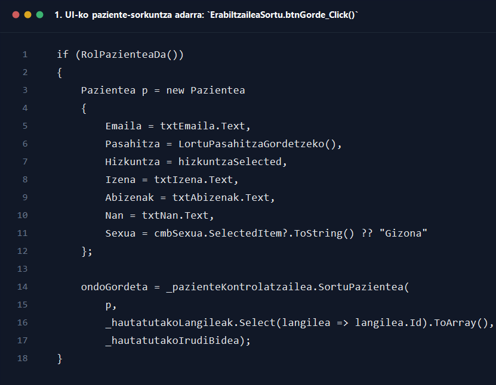
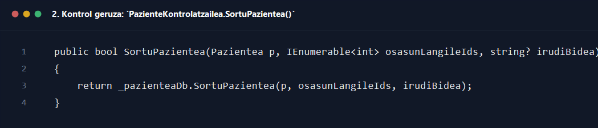
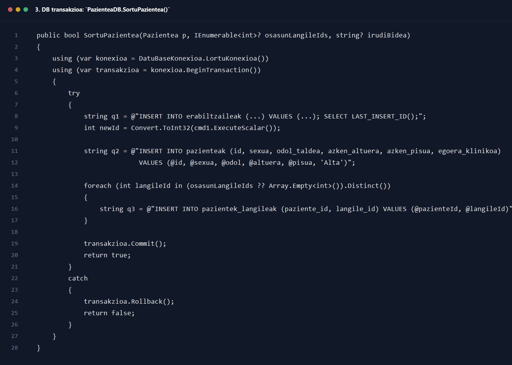

# 2. Harrerakoa pazientea sortu

## Helburua

Dokumentu honek `2_harrerakoa_pazientea_sortu.drawio` sekuentzia-diagramaren fluxua azaltzen du, harrerako langileak paziente berri bat sortzen duenetik pazientea, haren erabiltzaile-erregistroa eta osasun-langileen esleipenak datu-basean gordetzen diren arte.

## Oharra diagramari buruz

Kode eguneratuan prozesu hau ez du `ErabiltzaileKontrolatzailea`-k egiten, baizik eta `PazienteKontrolatzailea`-k. Beraz, azalpena kode erreal eguneratuan oinarrituta dago.

## Parte-hartzaile nagusiak

- Harrerako langilea edo osasun-langilea, erabiltzaile berria sortzeko pantailan
- `Interfazea/Harrerakoa/ErabiltzaileaSortu.cs`
- `Kontrola/PazienteKontrolatzailea.cs`
- `Kontrola/OsasunLangileKontrolatzailea.cs`
- `Kontrola/HarrerakoLangileKontrolatzailea.cs`
- `Repositorioa/PazienteaDB.cs`
- MySQL datu-basea

## Fluxu nagusia pausoz pauso

1. Erabiltzaileak `ErabiltzaileaSortu` formularioa irekitzen du paziente berria sortzeko.
2. Formularioak aurretik osasun-langileen zerrenda kargatu dezake `_osasunLangileKontrolatzailea.LortuGuztiakOsasunLangileak()` metodoaren bidez, pazienteari profesionalak esleitu ahal izateko.
3. Erabiltzaileak inprimakia betetzen du: izena, abizenak, emaila, pasahitza, NAN, sexua, jaiotze-data, kontaktu-datuak, odol-taldea, azken pisua, azken altuera eta pazienteari esleituko zaizkion osasun-langileak.
4. Erabiltzaileak `Gorde` botoia sakatzen du eta `btnGorde_Click(object sender, EventArgs e)` exekutatzen da.
5. `btnGorde_Click()` metodoak lehen baliozkotze sinkronoak egiten ditu.
6. Derrigorrezko eremuren bat hutsik badago, `MessageBox.Show("(*) markatutako eremuak nahitaezkoak dira.", ...)` erakusten da eta metodoa `return` bidez amaitzen da.
7. Rol hautatua pazientea bada eta `_hautatutakoLangileak.Count == 0` bada, erabiltzaileari gutxienez osasun-langile bat aukeratu behar duela adierazten zaio eta prozesua bertan behera uzten da.
8. `SaiatuLortuDecimala(txtPisua.Text, ...)` eta `SaiatuLortuDecimala(txtAltuera.Text, ...)` deitzen dira pisua eta altuera ondo formatuta daudela egiaztatzeko.
9. Balio horiek ezin badira hamartar moduan bihurtu, metodo laguntzaileak abisua erakusten du eta `false` itzultzen du; `btnGorde_Click()`-ek `return` egiten du.
10. Baliozkotzeak ondo badaude, `Pazientea` objektu bat eraikitzen da formularioaren datuekin.
11. `Irudia = LortuIrudiBideaGordetzeko() ?? "img/lehenetsia.png"` esleitzen zaio, hau da, erabiltzaileak aukeratutako irudia edo lehenetsitakoa.
12. Ondoren `_pazienteKontrolatzailea.SortuPazientea(p, _hautatutakoLangileak.Select(langilea => langilea.Id).ToArray(), _hautatutakoIrudiBidea)` deitzen da.
13. `PazienteKontrolatzailea.SortuPazientea(...)` metodoak deia zuzenean `_pazienteaDb.SortuPazientea(...)` repository-ra delegatzen du.
14. `PazienteaDB.SortuPazientea(Pazientea p, IEnumerable<int>? osasunLangileIds, string? irudiBidea)` metodoak DB konexioa irekitzen du eta transakzio bat hasten du `BeginTransaction()` erabiliz.
15. Lehen txertaketa `erabiltzaileak` taulan egiten da. Query-ak pazientearen autentifikazio eta oinarrizko datu guztiak gordetzen ditu eta `SELECT LAST_INSERT_ID();` bidez ID berria lortzen du.
16. `cmd1.ExecuteScalar()`-ek erabiltzaile berriaren `id` itzultzen du eta balio hori `newId` aldagaiak jasotzen du.
17. Bigarren txertaketa `pazienteak` taulan egiten da, `newId` bera erabiliz. Hemen sexua, odol-taldea, azken altuera, azken pisua eta hasierako egoera klinikoa (`Alta`) gordetzen dira.
18. Gero `foreach` baten bidez aukeratutako osasun-langile bakoitzarentzat `pazientek_langileak` taulan lotura-erregistro bana sortzen da.
19. Txertaketa guztiak ondo badoaz, `transakzioa.Commit()` exekutatzen da eta `SortuPazientea(...)` metodoak `true` itzultzen du.
20. Kontrolatzailera `true` bueltatzen da eta gero interfazera itzultzen da `ondoGordeta = true` moduan.
21. UIk arrakasta-mezua erakusten du: `${_rolIzena} ondo gorde da sistemako datu-basean.`
22. Azkenik, formularioa `this.Close()` bidez ixten da.

## Itzulera-balioak eta erantzunak

- `SaiatuLortuDecimala(...)` -> `bool`
- `PazienteKontrolatzailea.SortuPazientea(...)` -> `bool`
- `cmd1.ExecuteScalar()` -> erabiltzaile berriaren `id`
- `PazienteaDB.SortuPazientea(...)` -> `true` edo `false`

## Errore-adarrak eta baliozkotzeak

- Derrigorrezko eremuak hutsik badaude, ez da kontrolatzailera pasatzen.
- Pazienteak ez badu gutxienez osasun-langile esleituta, ez da gordetzen.
- Pisua edo altuera ez badira zenbaki baliozkoak, `SaiatuLortuDecimala()`-k abisua erakusten du.
- DB txertaketetako edozein puntutan salbuespena gertatzen bada, `catch` blokeak `transakzioa.Rollback()` exekutatzen du eta repository-ak `false` itzultzen du.
- Repository-ak `false` itzultzen badu, UIk errore mezua erakusten du: `Ziurtatu e-maila edota NAN-a ez direla errepikatzen ari.`

## Amaierako egoera

- Arrakastaz amaitzean, paziente berriak hiru mailatako datuak ditu: erabiltzaile kontua, paziente erregistro klinikoa eta osasun-langile esleipenak.
- Hutsegitean, ez da gordetze partzialik mantentzen, transakzioaren `Rollback()` delakoaren ondorioz.

## Kode pantailazoak

### 1. UI-ko paziente-sorkuntza adarra: `ErabiltzaileaSortu.btnGorde_Click()`

Iturria: `GOsasun_app/Interfazea/Harrerakoa/ErabiltzaileaSortu.cs`

### 2. Kontrol geruza: `PazienteKontrolatzailea.SortuPazientea()`

Iturria: `GOsasun_app/Kontrola/PazienteKontrolatzailea.cs`

### 3. DB transakzioa: `PazienteaDB.SortuPazientea()`

Iturria: `GOsasun_app/Repositorioa/PazienteaDB.cs`
