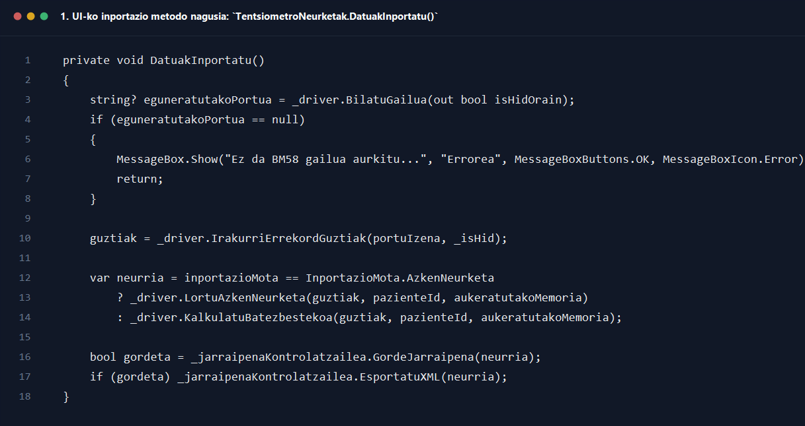
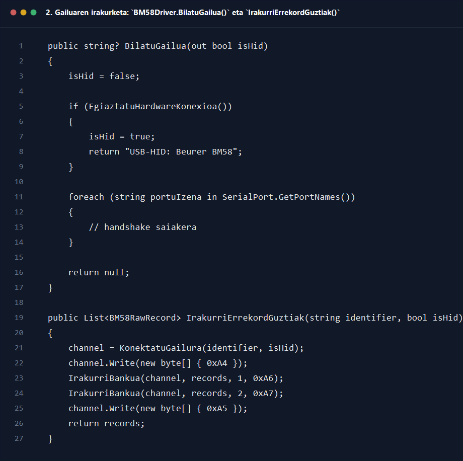
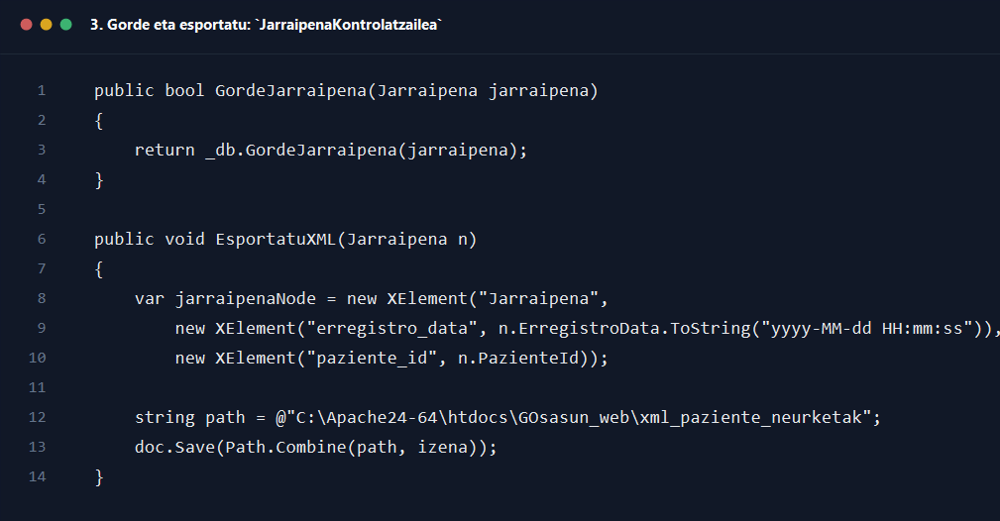

# 3. Pazientea tentsiometro jarraipena sortu

## Helburua

Dokumentu honek `3_pazientea_tentsiometro_jarraipena_sortu.drawio` sekuentzia-diagramaren fluxua azaltzen du, erabiltzaileak BM58 gailutik neurketa inportatzen duenetik jarraipena datu-basean gorde eta XML fitxategi gisa esportatu arte.

## Parte-hartzaile nagusiak

- Erabiltzailea, normalean osasun-langilea edo pazientea
- `Interfazea/Osasun_Langilea/TentsiometroNeurketak.cs`
- `Kontrola/Zerbitzuak/BM58Driver.cs`
- `Kontrola/JarraipenaKontrolatzailea.cs`
- `Repositorioa/JarraipenaDB.cs`
- Web karpetako XML esportazioa

## Fluxu nagusia pausoz pauso

1. Erabiltzaileak `TentsiometroNeurketak` pantaila irekitzen du eta BM58 gailua USB bidez konektatuta edukitzen du.
2. Inportazio botoia sakatzean `_btnInportatu.Click += (s, e) => DatuakInportatu();` ekintzak `DatuakInportatu()` deitzen du.
3. `DatuakInportatu()` metodoak lehenengo zein pazienteri lotuko zaion neurketa erabakitzen du.
4. Erabiltzailea pazientea bera bada, `_erabiltzailea.Id` erabiltzen da.
5. Aurrehautatutako pazientea badago, `_pazienteIdAurrehautatu.Value` erabiltzen da.
6. Bestela, grid-eko hautatutako pazientearen `Id` hartzen da.
7. Ondoren `_driver.BilatuGailua(out bool isHidOrain)` deitzen da gailua aurkitzeko.
8. `BM58Driver.BilatuGailua()` metodoak lehenengo HID bidez saiatzen da `EgiaztatuHardwareKonexioa()` erabiliz.
9. HID bidez aurkitzen ez bada, serie-portuen zerrenda irakurtzen du eta portu bakoitzean handshake bat egiten saiatzen da.
10. Gailua aurkitzen ez bada, `null` itzultzen du.
11. `DatuakInportatu()` metodora itzulita, `null` bada erabiltzaileari errorea erakusten zaio: BM58 ez dela aurkitu edo `PC` moduan ez dagoela.
12. Gailua aurkitzen bada, `_portuIzena` eta `_isHid` eguneratzen dira.
13. Ondoren modal bat irekitzen da eta haren `Shown` gertakarian `Task.Run(() => _driver.IrakurriErrekordGuztiak(portuIzena, _isHid))` exekutatzen da.
14. `BM58Driver.IrakurriErrekordGuztiak()` metodoak gailura konektatzen da `KonektatuGailura(identifier, isHid)` erabiliz.
15. Konektatutako kanalari init komandoa bidaltzen zaio eta bi memoria-bankuak irakurtzen dira: U1 eta U2.
16. `IrakurriBankua(...)` metodoak 0 eta 59 arteko indizeak iteratzen ditu eta datu-pakete baliodunak soilik gordetzen ditu `records` zerrendan.
17. Duplicate pakete jarraituak edo dagoeneko jasotako paketeak baztertzen dira.
18. Irakurketa ondo amaitzean, `IrakurriErrekordGuztiak()`-ek `List<BM58RawRecord>` itzultzen du.
19. BM58 komunikazioan arazoa badago, `BM58KomunikazioSalbuespena` harrapatu eta `konekzioErrorea` testuan gordetzen da.
20. Modalak `DialogResult.OK` edo `DialogResult.Cancel` jartzen du eta ixteko agintzen du.
21. Irteera `OK` ez bada, UIk errore-mezua erakusten du eta fluxua amaitzen da.
22. Errekordurik ez badago, metodoa isilean amaitu daiteke, gordetzerik egin gabe.
23. Errekorduak badaude, `_driver.AnalizatuErrekordak(guztiak)` deitzen da U1 eta U2 memorian zenbat neurketa dauden jakiteko.
24. Erabiltzaileari memoria hautatzeko formularioa erakusten zaio.
25. U1 edo U2 botoietako bat sakatzean `aukeratutakoMemoria` ezartzen da.
26. Ondoren `EskatuInportazioMota(aukeratutakoMemoria)` deitzen da.
27. Metodo horrek beste formulario bat erakusten du eta erabiltzaileak `AzkenNeurketa` edo `Batezbestekoa` aukeratzen du.
28. Aukeraren arabera, `DatuakInportatu()`-k `_driver.LortuAzkenNeurketa(guztiak, pazienteId, aukeratutakoMemoria)` edo `_driver.KalkulatuBatezbestekoa(guztiak, pazienteId, aukeratutakoMemoria)` deitzen du.
29. `LortuAzkenNeurketa()` metodoak memoriako lehen neurketa balioduna hartzen du, tentsioak egokitzen ditu eta `Jarraipena` objektua sortzen du `Oharrak = "U{memoria} azken neurketa - 01 posizioa..."` balioarekin.
30. `KalkulatuBatezbestekoa()` metodoak memoriako erregistro guztiak iteratzen ditu, balio sistolikoak, diastolikoak eta pultsua batzen ditu eta batezbestekoarekin `Jarraipena` objektu bat itzultzen du.
31. Neurketaren kalkulua eginda, erabiltzaileari `JarraipenOharLaguntzailea.EskatuAukerakoOharra(...)` bidez ohar gehigarri bat idazteko aukera ematen zaio.
32. `JarraipenOharLaguntzailea.BatuOharrak(...)` metodoak BM58-tik datorren oharra eta erabiltzailearen ohar osagarria bateratzen ditu.
33. Orduan `_jarraipenaKontrolatzailea.GordeJarraipena(neurria)` deitzen da.
34. `JarraipenaKontrolatzailea.GordeJarraipena()` metodoak `_db.GordeJarraipena(jarraipena)` deitzen du.
35. `JarraipenaDB.GordeJarraipena()` metodoak barruan `GordeJarraipenaEtaLortuId(jarraipena).HasValue` erabiltzen du.
36. `GordeJarraipenaEtaLortuId()`-ek `jarraipenak` taulan `INSERT` egiten du eta `LAST_INSERT_ID()` erabiliz ID berria lortzen du.
37. DB gordetzea ondo badoa, `true` bueltatzen da UIra.
38. UIk ondoren `_jarraipenaKontrolatzailea.EsportatuXML(neurria)` deitzen du.
39. `EsportatuXML()` metodoak `Jarraipena` XML bihurtzen du eta `C:\Apache24-64\htdocs\GOsasun_web\xml_paziente_neurketak` karpetan gordetzen du.
40. Azkenik, erabiltzaileari arrakasta-mezu bat erakusten zaio inportatutako balioekin eta formularioa ixten da.

## Itzulera-balioak eta erantzunak

- `BM58Driver.BilatuGailua(...)` -> `string?` gailuaren identifikatzailea edo `null`
- `BM58Driver.IrakurriErrekordGuztiak(...)` -> `List<BM58RawRecord>`
- `BM58Driver.LortuAzkenNeurketa(...)` -> `Jarraipena?`
- `BM58Driver.KalkulatuBatezbestekoa(...)` -> `Jarraipena?`
- `JarraipenaKontrolatzailea.GordeJarraipena(...)` -> `bool`
- `JarraipenaKontrolatzailea.EsportatuXML(...)` -> `void`

## Errore-adarrak eta baliozkotzeak

- Pazientea aukeratuta ez badago eta ezin bada `pazienteId` ebatzi, inportazioa ez da hasten.
- BM58 gailua aurkitzen ez bada, prozesua errore-mezuarekin amaitzen da.
- `IrakurriErrekordGuztiak()` exekutatzean komunikazio-salbuespena bada, haren mezua erabiltzaileari bistaratzen zaio.
- Memoria batean neurketa baliodunik ez badago, `LortuAzkenNeurketa()` edo `KalkulatuBatezbestekoa()` metodoek salbuespena jaurti dezakete.
- `GordeJarraipena()`-k `false` itzultzen badu, UIk `Ezin izan da datu-basean gorde.` mezua erakusten du.
- `EsportatuXML()` barruko erroreak ez dira UIra igotzen; debug irteeran soilik erregistratzen dira.
- `catch (Exception ex)` bloke orokorrak `Errorea inportatzean:` mezua erakusten du.

## Amaierako egoera

- Arrakastaz amaitzean, neurketa berria datu-basean dago, oharra gehituta egon daiteke eta XML esportatua ere sortuta dago.
- Hutsegitean, erabiltzailea pantailan geratzen da eta, `finally` blokean, gailuaren bilaketa berrabiaraz daiteke.

## Kode pantailazoak

### 1. UI-ko inportazio metodo nagusia: `TentsiometroNeurketak.DatuakInportatu()`

Iturria: `GOsasun_app/Interfazea/Osasun_Langilea/TentsiometroNeurketak.cs`

### 2. Gailuaren irakurketa: `BM58Driver.BilatuGailua()` eta `IrakurriErrekordGuztiak()`

Iturria: `GOsasun_app/Kontrola/Zerbitzuak/BM58Driver.cs`

### 3. Gorde eta esportatu: `JarraipenaKontrolatzailea`

Iturria: `GOsasun_app/Kontrola/JarraipenaKontrolatzailea.cs`
