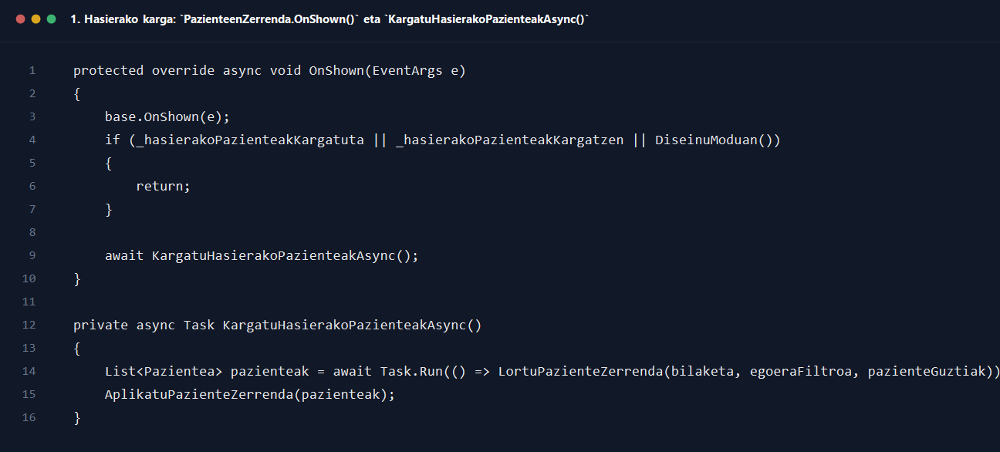
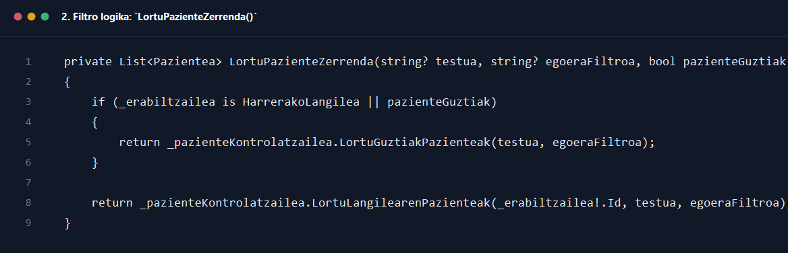
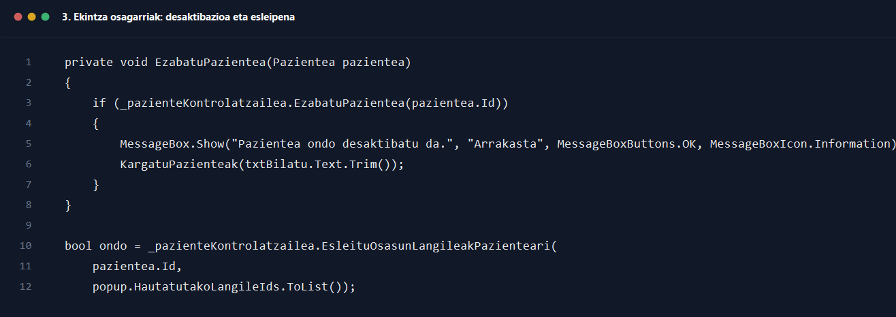

# 4. Osasun langilea paziente zerrenda ikusi

## Helburua

Dokumentu honek `4_osasun_langilea_paziente_zerrenda_ikusi.drawio` sekuentzia-diagramaren prozesua azaltzen du, osasun-langileak edo harrerako langileak pazienteen zerrenda bistaratzen duenetik taulan bilatu, orrialdeztatu, desaktibatu edo esleipenak eguneratu arte.

## Parte-hartzaile nagusiak

- Erabiltzailea
- `Interfazea/Osasun_Langilea/PazienteenZerrenda.cs`
- `Kontrola/PazienteKontrolatzailea.cs`
- `Kontrola/OsasunLangileKontrolatzailea.cs`
- `Repositorioa/PazienteaDB.cs`
- `EsleituOsasunLangileakLaguntzailea`

## Fluxu nagusia pausoz pauso

1. Erabiltzaileak `PazienteenZerrenda` pantaila irekitzen du.
2. Formularioaren `OnShown(EventArgs e)` metodoa exekutatzen da.
3. `OnShown()` metodoak diseinu eta tamaina egokitzapenak egiten ditu eta, hasierako karga egin ez bada, `await KargatuHasierakoPazienteakAsync()` deitzen du.
4. `KargatuHasierakoPazienteakAsync()` metodoak UI egoera kargatzen moduan jartzen du `EzarriHasierakoKargaEgoera(true)` bidez.
5. Ondoren bilaketa testua, egoera-filtroa eta `chkPazienteGuztiak` checkbox-aren egoera irakurtzen ditu.
6. `Task.Run(() => LortuPazienteZerrenda(...))` exekutatzen da karga nagusia hari nagusitik kanpo egiteko.
7. `LortuPazienteZerrenda(string? testua, string? egoeraFiltroa, bool pazienteGuztiak)` metodoak erabiltzaile mota aztertzen du.
8. Erabiltzailea harrerakoa bada edo `pazienteGuztiak` aktibo badago, `_pazienteKontrolatzailea.LortuGuztiakPazienteak(testua, egoeraFiltroa)` deitzen da.
9. Bestela, `_pazienteKontrolatzailea.LortuLangilearenPazienteak(_erabiltzailea!.Id, testua, egoeraFiltroa)` deitzen da.
10. `PazienteKontrolatzailea`-k repository-ra delegatzen du eta `List<Pazientea>` itzultzen du.
11. Interfazeak `AplikatuPazienteZerrenda(pazienteak)` deitzen du.
12. `AplikatuPazienteZerrenda()` metodoak `_pazienteak` barruko zerrenda eguneratzen du eta `BistaratuUnekoOrria(lehenOrriraJoan: true)` deitzen du.
13. `BistaratuUnekoOrria()`-k une horretako orrialdeko pazienteak kalkulatzen ditu `Skip(...).Take(...)` erabiliz eta `dgvPazienteak.DataSource` eguneratzen du.
14. `EguneratuPaginazioKontrolak()` metodoak orrialde kopurua, erakutsi beharreko tartea eta aurreko/hurrengo botoien egoera eguneratzen ditu.
15. Erabiltzaileak bilaketa-koadroan testua idazten badu, `TxtBilatu_TextChanged()` exekutatzen da eta `KargatuPazienteak(txtBilatu.Text.Trim())` deitzen da.
16. `KargatuPazienteak()`-ek berriz kalkulatzen du zein zerrenda eskatu eta `AplikatuPazienteZerrenda()` exekutatzen du.
17. Erabiltzaileak egoera-filtroa aldatzen badu, `EgoeraFiltroa_CheckedChanged()` exekutatzen da; checkbox bakarra aktibo uzten du eta berriz kargatzen du zerrenda.
18. `chkPazienteGuztiak` aldatzen bada, `PazienteMotaFiltroa_CheckedChanged()` exekutatzen da eta paziente guztiak edo esleitutakoak erakusten dira.
19. Orrialdeak aldatzeko, `_btnAurrekoOrria` edo `_btnHurrengoOrria` sakatzen direnean `BtnAurrekoOrria_Click()` edo `BtnHurrengoOrria_Click()` deitzen dira eta `_unekoOrria` balioa aldatzen da.
20. Erabiltzaileak taulako `ikusi` edo `editatu` botoia sakatzen badu, `DgvPazienteak_CellMouseClick()` metodoak dagokion pazientea ebatzi eta `IrekiFormularioa(new PazienteXehetasunak(pazientea))` deitzen du.
21. `ezabatu` botoia sakatzen badu, `EzabatuPazientea(pazientea)` deitzen da.
22. `EzabatuPazientea()` metodoak lehenik berrespen-koadroa erakusten du.
23. Erabiltzaileak `Yes` hautatzen badu, `_pazienteKontrolatzailea.EzabatuPazientea(pazientea.Id)` deitzen da.
24. Kontrolatzaileak repository-ra delegatzen du, eta repository-ak praktikan pazientea desaktibatzen du, ez fisikoki ezabatu.
25. Itzulera `true` bada, arrakasta-mezua erakusten da eta `KargatuPazienteak(...)` berriz deitzen da.
26. Erabiltzaileak pazienteari osasun-langileak esleitzeko ekintza irekitzen badu, `EsleituOsasunLangileak(pazientea)` exekutatzen da.
27. Metodo horrek `_osasunLangileKontrolatzailea.LortuGuztiakOsasunLangileak()` eta `_pazienteKontrolatzailea.LortuPazientearenOsasunLangileak(pazientea.Id)` deitzen ditu hasierako datuak prestatzeko.
28. `EsleituOsasunLangileakLaguntzailea` popup-a irekitzen da, erabiltzaileak osasun-langileak hautatzen ditu eta `DialogResult.OK` bueltatzen bada `_pazienteKontrolatzailea.EsleituOsasunLangileakPazienteari(...)` deitzen da.
29. Kontrolatzaileak repository-ra delegatzen du eta hark aurreko esleipenak ezabatu eta berriak txertatzen ditu transakzio batean.
30. Ondoren erabiltzaileari arrakasta edo errore mezua erakusten zaio eta zerrenda berriz kargatzen da.

## Itzulera-balioak eta erantzunak

- `LortuPazienteZerrenda(...)` -> `List<Pazientea>`
- `PazienteKontrolatzailea.LortuGuztiakPazienteak(...)` -> `List<Pazientea>`
- `PazienteKontrolatzailea.LortuLangilearenPazienteak(...)` -> `List<Pazientea>`
- `PazienteKontrolatzailea.EzabatuPazientea(...)` -> `bool`
- `PazienteKontrolatzailea.EsleituOsasunLangileakPazienteari(...)` -> `bool`

## Errore-adarrak eta baliozkotzeak

- Hasierako kargan edo bilaketan salbuespena gertatzen bada, `Errorea pazienteak kargatzean:` mezua erakusten da.
- Zerrenda hutsik badago, paginazioaren testua `0 erregistro` bihurtzen da.
- Desaktibatzeko berrespena ezeztatzen bada, ez da ezer aldatzen.
- `_pazienteKontrolatzailea.EzabatuPazientea(...)`-k `false` itzultzen badu, UIk errore-mezua erakusten du.
- Osasun-langileen esleipenean `false` itzultzen bada, `Ezin izan dira osasun langileak pazienteari esleitu.` mezua erakusten da.

## Amaierako egoera

- Fluxu arruntean, erabiltzaileak paziente-zerrenda eguneratua ikusten du, filtro eta orrialdeztapenarekin.
- Ekintza osagarrien ondoren, taula beti berriz kargatzen da egoera berria islatzeko.

## Kode pantailazoak

### 1. Hasierako karga: `PazienteenZerrenda.OnShown()` eta `KargatuHasierakoPazienteakAsync()`

Iturria: `GOsasun_app/Interfazea/Osasun_Langilea/PazienteenZerrenda.cs`

### 2. Filtro logika: `LortuPazienteZerrenda()`

Iturria: `GOsasun_app/Interfazea/Osasun_Langilea/PazienteenZerrenda.cs`

### 3. Ekintza osagarriak: desaktibazioa eta esleipena

Iturria: `GOsasun_app/Interfazea/Osasun_Langilea/PazienteenZerrenda.cs`
