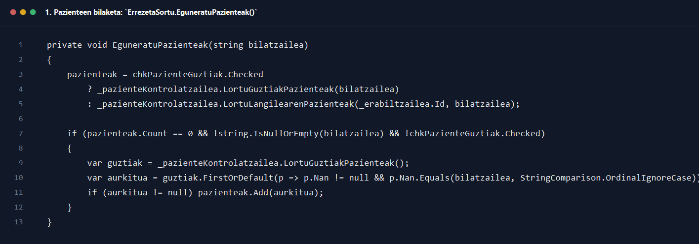
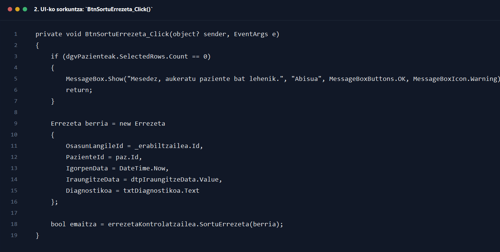
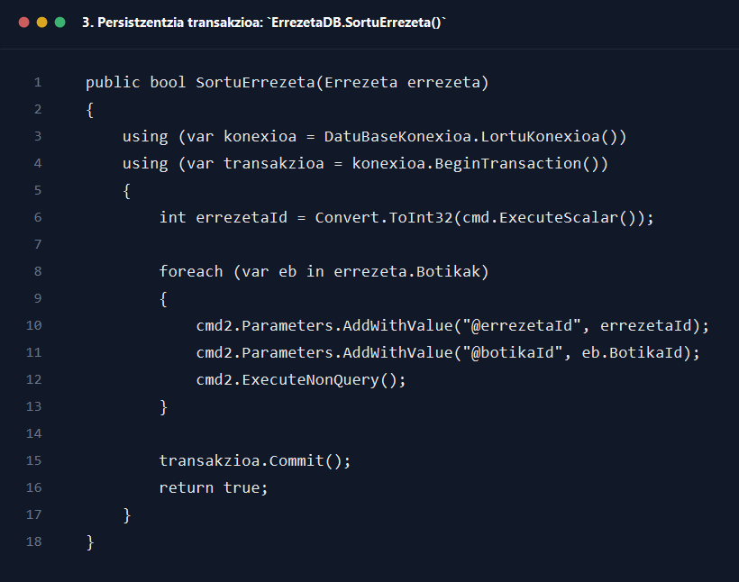

# 5. Osasun langilea errezeta sortu

## Helburua

Dokumentu honek `5_osasun_langilea_errezeta_sortu.drawio` sekuentzia-diagramaren fluxua azaltzen du, osasun-langileak paziente bat bilatu, botikak gehitu eta errezeta berria datu-basean gorde arte.

## Oharra diagramari buruz

Kode eguneratuan pazienteak bilatzeko `PazienteKontrolatzailea` erabiltzen da eta errezeta gordetzeko `ErrezetaKontrolatzailea`. Beraz, azalpena ez dago facade zaharrean oinarrituta.

## Parte-hartzaile nagusiak

- Osasun-langilea
- `Interfazea/Osasun_Langilea/ErrezetaSortu.cs`
- `Kontrola/PazienteKontrolatzailea.cs`
- `Kontrola/ErrezetaKontrolatzailea.cs`
- `Repositorioa/PazienteaDB.cs`
- `Repositorioa/ErrezetaDB.cs`

## Fluxu nagusia pausoz pauso

1. Osasun-langileak `ErrezetaSortu` formularioa irekitzen du.
2. Formularioaren hasieran `EguneratuPazienteak("")` deitzen da pazienteen lehen zerrenda erakusteko.
3. Erabiltzaileak bilaketa-koadroan NAN edo testuren bat idazten duenean `TxtBilatuPaz_TextChanged()` exekutatzen da.
4. Metodo horrek `EguneratuPazienteak(txtBilatuPaz.Text)` deitzen du.
5. `EguneratuPazienteak(string bilatzailea)` metodoak erabiltzailearen rola aztertzen du.
6. `chkPazienteGuztiak` aktibo badago, `_pazienteKontrolatzailea.LortuGuztiakPazienteak(bilatzailea)` deitzen du.
7. Bestela, `_pazienteKontrolatzailea.LortuLangilearenPazienteak(_erabiltzailea.Id, bilatzailea)` deitzen du.
8. Itzulitako `List<Pazientea>` zerrendarekin grid-erako DTO txikiak sortzen dira: `Nan` eta `IzenOsoa`.
9. Emaitza bakarra badago, interfazea automatikoki paziente hori hautatzen saiatzen da.
10. Bilaketa zehatz batean medikuaren zerrendan ez bada ezer aurkitzen, fallback gisa `_pazienteKontrolatzailea.LortuGuztiakPazienteak()` deitzen da eta NAN berdina duen pazientea eskuz bilatzen da.
11. Erabiltzaileak botika bat aukeratzen du eta `Gehitu botika` botoia sakatzen duenean `BtnGehituBotika_Click()` exekutatzen da.
12. Metodo horrek `cmbBotikak.SelectedItem is Botika` egiaztatzen du.
13. Botika baliozkoa bada, `ErrezetaBotikaItem` berri bat gehitzen zaio `saskia` zerrendari, dosia eta maiztasuna barne.
14. Ondoren `txtDosia.Clear()`, `txtMaiztasuna.Clear()` eta `EguneratuSaskia()` deitzen dira.
15. `EguneratuSaskia()` metodoak grid-eko datu-iturburua berriz lotzen du eta zutabeen izenak eta ikusgaitasuna eguneratzen ditu.
16. Erabiltzaileak `Sortu errezeta` botoia sakatzen duenean `BtnSortuErrezeta_Click()` exekutatzen da.
17. Formularioa editatze moduan badago, errezeta lehendik dagoena eguneratzen da `EguneratuErrezeta(...)` bidez. Diagrama honetan, ordea, sorkuntza-fluxu arrunta azaltzen da.
18. Sorkuntza arruntean, lehenengo egiaztatzen da paziente bat hautatuta dagoen.
19. Pazienterik hautatu ez bada, `Mesedez, aukeratu paziente bat lehenik.` mezua erakusten da eta fluxua eteten da.
20. `saskia.Count == 0` bada, `Gutxienez botika bat gehitu behar duzu...` mezua erakusten da eta ez da ezer gordetzen.
21. Baliozkotzeak ondo badaude, hautatutako pazientearen indizea hartzen da eta hari dagokion `Pazientea` objektua berreskuratzen da.
22. `Errezeta berria = new Errezeta { ... }` objektua sortzen da: osasun-langile IDa, paziente IDa, igorpen data, iraungitze data eta diagnostikoa betez.
23. `foreach (var s in saskia)` iterazioaren bidez botika bakoitza `berria.Botikak` zerrendara gehitzen da `ErrezetaBotika` moduan.
24. Orduan `errezetaKontrolatzailea.SortuErrezeta(berria)` deitzen da.
25. `ErrezetaKontrolatzailea.SortuErrezeta()` metodoak `_errezetaDb.SortuErrezeta(errezeta)` deitzen du.
26. `ErrezetaDB.SortuErrezeta()` metodoak DB konexioa ireki eta `BeginTransaction()` erabiltzen du transakzio bat hasteko.
27. Lehenik `errezetak` taulan erregistro nagusia txertatzen du: hitzordu IDa, osasun-langile IDa, paziente IDa, igorpen data, iraungitze data, XML bidea, diagnostiko laburra eta `aktibo` egoera.
28. `ExecuteScalar()`-ek sortutako `errezetaId` berria itzultzen du.
29. Gero `foreach (var eb in errezeta.Botikak)` bueltan botika bakoitza `errezeta_botikak` taulan txertatzen da, `errezetaId`, `botika_id`, `dosia` eta `maiztasuna` erabiliz.
30. Guztia ondo badoa, `transakzioa.Commit()` egiten da eta repository-ak `true` itzultzen du.
31. UIra bueltatuta, `emaitza == true` bada arrakasta-mezua erakusten da.
32. Ondoren diagnostiko koadroa garbitu, iraungitze-data lehenetsi eta `saskia.Clear()` egiten da.
33. Amaitzeko `EguneratuSaskia()` deitzen da, formularioa beste errezeta bat sortzeko prest uzteko.

## Itzulera-balioak eta erantzunak

- `PazienteKontrolatzailea.LortuGuztiakPazienteak(...)` -> `List<Pazientea>`
- `PazienteKontrolatzailea.LortuLangilearenPazienteak(...)` -> `List<Pazientea>`
- `ErrezetaKontrolatzailea.SortuErrezeta(...)` -> `bool`
- `ErrezetaDB.SortuErrezeta(...)` -> `true` edo `false`
- `ExecuteScalar()` -> sortutako `errezetaId`

## Errore-adarrak eta baliozkotzeak

- Pazienterik hautatzen ez bada, errezeta ez da sortzen.
- Saskia hutsik badago, gutxienez botika bat gehitzeko eskatzen zaio erabiltzaileari.
- Repository-an salbuespena gertatzen bada, `transakzioa.Rollback()` egiten da eta `false` itzultzen da.
- `SortuErrezeta(...)`-k `false` itzultzen badu, UIk `Errore bat egon da errezeta sortzean.` erakusten du.
- Pazienteen bilaketan medikuaren zerrendan pazientea ez aurkitzeak ez du errorea sortzen; fallback bilaketa egiten da NAN bidez.

## Amaierako egoera

- Arrakastaz amaitzean, errezeta nagusia eta haren botikak transakzio berean gordeta daude.
- Hutsegitean, ez da errezeta erdi-gordeturik geratzen, `Rollback()` delakoaren ondorioz.

## Kode pantailazoak

### 1. Pazienteen bilaketa: `ErrezetaSortu.EguneratuPazienteak()`

Iturria: `GOsasun_app/Interfazea/Osasun_Langilea/ErrezetaSortu.cs`

### 2. UI-ko sorkuntza: `BtnSortuErrezeta_Click()`

Iturria: `GOsasun_app/Interfazea/Osasun_Langilea/ErrezetaSortu.cs`

### 3. Persistzentzia transakzioa: `ErrezetaDB.SortuErrezeta()`

Iturria: `GOsasun_app/Repositorioa/ErrezetaDB.cs`
