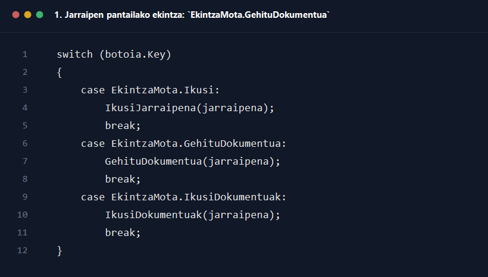
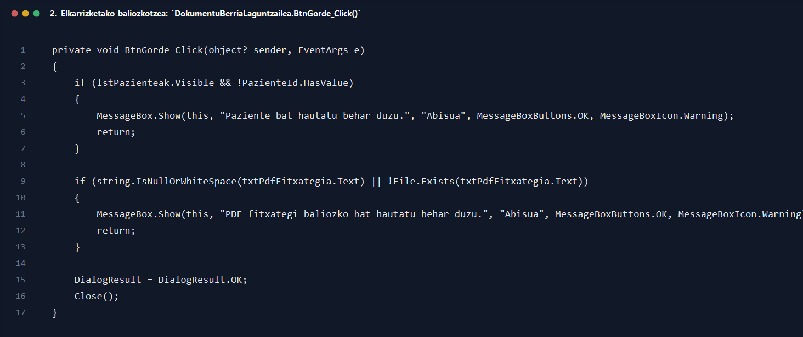
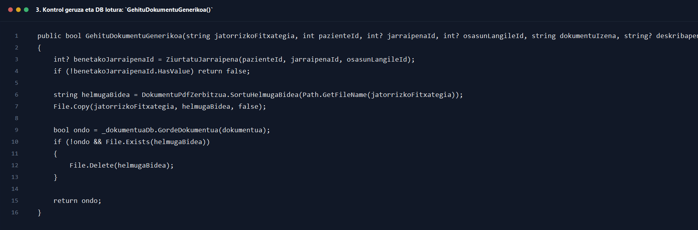

# 6. Osasun langilea dokumentua gehitu jarraipenari

## Helburua

Dokumentu honek `6_osasun_langilea_dokumentua_gehitu_jarraipenari.drawio` sekuentzia-diagramaren fluxua azaltzen du, osasun-langileak jarraipen baten gainean dokumentu bat gehitzen duenetik PDF fitxategia zerbitzarian kopiatu eta dokumentu-erregistroa datu-basean lotu arte.

## Oharra diagramari buruz

Kode eguneratuan prozesuak `DokumentuBerriaLaguntzailea` elkarrizketa erabiltzen du, eta `DokumentuaKontrolatzailea`-k behar denean jarraipen automatiko bat ere sor dezake. Horiek ez dira beti marraztuta ageri jatorrizko diagraman.

## Parte-hartzaile nagusiak

- Osasun-langilea
- `Interfazea/Osasun_Langilea/Jarraipenak.cs`
- `Interfazea/DokumentuBerriaLaguntzailea.cs`
- `Kontrola/DokumentuaKontrolatzailea.cs`
- `Kontrola/JarraipenaKontrolatzailea.cs`
- `Kontrola/Zerbitzuak/DokumentuPdfZerbitzua.cs`
- `Repositorioa/DokumentuaDB.cs`
- `Repositorioa/JarraipenaDB.cs`

## Fluxu nagusia pausoz pauso

1. Osasun-langileak `Jarraipenak` pantaila irekitzen du eta taulako erregistro batean `Gehitu dokumentua` ekintza aukeratzen du.
2. `Dgv...CellMouseClick` motako fluxuan, `switch` blokeak `case EkintzaMota.GehituDokumentua:` detektatzen du eta `GehituDokumentua(jarraipena)` deitzen du.
3. `GehituDokumentua(jarraipena)` metodotik `DokumentuBerriaLaguntzailea` elkarrizketa irekitzen da normalean, jarraipen horri lotutako pazientearekin eta bilaketa-logikarekin hasieratuta.
4. `DokumentuBerriaLaguntzailea.Hasieratu(...)` metodoak pazienteak kargatzen ditu, eremuak garbitzen ditu eta paziente aukeraketa erakutsi edo ez erakutsi erabakitzen du.
5. Paziente aukeraketa ikusgai badago, `KargatuPazienteakBilaketarekin(null)` exekutatzen da eta zerrenda ordenatuta erakusten da.
6. Elkarrizketan erabiltzaileak, behar izanez gero, pazientea aukeratzen du, dokumentuaren izena betetzen du, deskribapena idazten du eta `PDF hautatu` botoia sakatzen du.
7. `BtnPdfHautatu_Click()` metodoak `OpenFileDialog` irekitzen du eta erabiltzaileak `.pdf` fitxategi bakar bat hautatzen du.
8. Fitxategia hautatutakoan, haren bidea `txtPdfFitxategia.Text` eremuan gordetzen da eta dokumentu-izenaren koadroa hutsik badago, fitxategi-izenetik betetzen da automatikoki.
9. Erabiltzaileak `Gorde` botoia sakatzen duenean `DokumentuBerriaLaguntzailea.BtnGorde_Click()` exekutatzen da.
10. Metodo horrek lehenengo baliozkotzeak egiten ditu.
11. Paziente aukeraketa ikusgai badago eta `PazienteId` ez badago, abisua erakusten da eta ez da elkarrizketa onartzen.
12. Dokumentuaren izena hutsik badago, erabiltzaileari hori bete behar duela esaten zaio.
13. PDF bidea hutsik badago edo fitxategia ez bada existitzen, `PDF fitxategi baliozko bat hautatu behar duzu.` mezua erakusten da.
14. Baliozkotze guztiak ondo badaude, elkarrizketak `DialogResult = DialogResult.OK` ezartzen du eta itxi egiten da.
15. Elkarrizketa onartuta itzultzean, formulario deitzaileak `_dokumentuaKontrolatzailea.GehituDokumentuGenerikoa(pdfFitxategia, pazienteId, jarraipenaId, osasunLangileId, dokumentuIzena, deskribapena)` deitzen du.
16. `DokumentuaKontrolatzailea.GehituDokumentuGenerikoa(...)` metodoak lehenengo `ZiurtatuJarraipena(...)` deitzen du.
17. `ZiurtatuJarraipena(...)` metodoak sarrerako `jarraipenaId` baliorik badu, zuzenean hori itzultzen du.
18. `jarraipenaId` hutsik badoa, `new Jarraipena { PazienteId = ..., OsasunLangileId = ..., Oharrak = ..., ErregistroData = DateTime.Now }` sortzen du eta `_jarraipenaKontrolatzailea.GordeJarraipenaEtaLortuId(jarraipena)` deitzen du.
19. Horrela, beharrezkoa bada, dokumentuari lotzeko jarraipen automatiko berri bat sortzen da.
20. `ZiurtatuJarraipena(...)`-k ID baliozkoa itzuli ondoren, `DokumentuPdfZerbitzua.SortuHelmugaBidea(Path.GetFileName(jatorrizkoFitxategia))` deitzen da.
21. Horren ondorioz, zerbitzarian edo dokumentu karpetan helmuga-bide absolutua kalkulatzen da.
22. `Directory.CreateDirectory(...)` bidez helmugaren direktorioa ziurtatzen da.
23. `File.Copy(jatorrizkoFitxategia, helmugaBidea, false)` exekutatzen da PDF fitxategia helmugara kopiatzeko.
24. Ondoren `Dokumentua` objektu berri bat eraikitzen da: `JarraipenaId`, `PazienteId`, fitxategi-izena, `BideaZerbitzarian`, dokumentu-izena, deskribapena eta igotze-data betez.
25. `DokumentuaKontrolatzailea`-k `_dokumentuaDb.GordeDokumentua(dokumentua)` deitzen du.
26. `DokumentuaDB.GordeDokumentua()` metodoak `dokumentuak` taulan `INSERT` bat exekutatzen du `jarraipena_id`, `fitxategi_izena`, `bidea_zerbitzarian`, `dokumentu_izena`, `deskribapena` eta `igotze_data` eremuekin.
27. `ExecuteNonQuery() > 0` bada, repository-ak `true` itzultzen du.
28. `GehituDokumentuGenerikoa(...)` metodora itzulita, `ondo` faltsua bada eta fitxategia helmugan existitzen bada, `File.Delete(helmugaBidea)` egiten da arrasto partzialak ez uzteko.
29. Metodoak `true` edo `false` itzultzen dio deitzaileari.
30. UIk arrakasta-mezua erakusten du eta `KargatuIragazkiekin()` berriz deitzen du jarraipenen zerrenda eguneratzeko.

## Itzulera-balioak eta erantzunak

- `DokumentuBerriaLaguntzailea.BtnGorde_Click()` -> elkarrizketaren `DialogResult.OK` edo baliozkotze-abortua
- `DokumentuaKontrolatzailea.ZiurtatuJarraipena(...)` -> `int?`
- `DokumentuaKontrolatzailea.GehituDokumentuGenerikoa(...)` -> `bool`
- `DokumentuaDB.GordeDokumentua(...)` -> `bool`
- `JarraipenaKontrolatzailea.GordeJarraipenaEtaLortuId(...)` -> `int?`

## Errore-adarrak eta baliozkotzeak

- Pazienterik hautatzen ez bada eta pantailak hori eskatzen badu, elkarrizketa ez da onartzen.
- Dokumentu-izena hutsik badago, ez da ezer gordetzen.
- PDF fitxategia ez bada existitzen edo ez bada hautatu, elkarrizketak errorea erakusten du.
- `ZiurtatuJarraipena(...)`-k `null` itzultzen badu, `GehituDokumentuGenerikoa(...)`-k `false` itzultzen du eta ez da kopiarik egiten.
- `File.Copy(...)` exekuzioan salbuespena gertatuz gero, prozesua eten daiteke eta UIk errorea erakutsiko du deitzaileko `catch` edo errore-kudeaketa bidez.
- DB `INSERT` huts egiten badu, kontrolatzaileak kopiatutako fitxategia ezabatzen du desoreka saihesteko.
- UIk `false` jasotzen badu, erabiltzaileari errore-mezua erakusten zaio eta zerrenda ez da arrakasta-gisa berriz kargatzen.

## Amaierako egoera

- Arrakastaz amaitzean, PDF fisikoki kopiatu da, dokumentu-erregistroa `dokumentuak` taulan dago eta jarraipenarekin lotuta geratu da.
- Jarraipenik ez bazegoen, automatiko bat sortuta gera daiteke dokumentuaren lotura ez galtzeko.

## Kode pantailazoak

### 1. Jarraipen pantailako ekintza: `EkintzaMota.GehituDokumentua`

Iturria: `GOsasun_app/Interfazea/Osasun_Langilea/Jarraipenak.cs`

### 2. Elkarrizketako baliozkotzea: `DokumentuBerriaLaguntzailea.BtnGorde_Click()`

Iturria: `GOsasun_app/Interfazea/DokumentuBerriaLaguntzailea.cs`

### 3. Kontrol geruza eta DB lotura: `GehituDokumentuGenerikoa()`

Iturria: `GOsasun_app/Kontrola/DokumentuaKontrolatzailea.cs`
