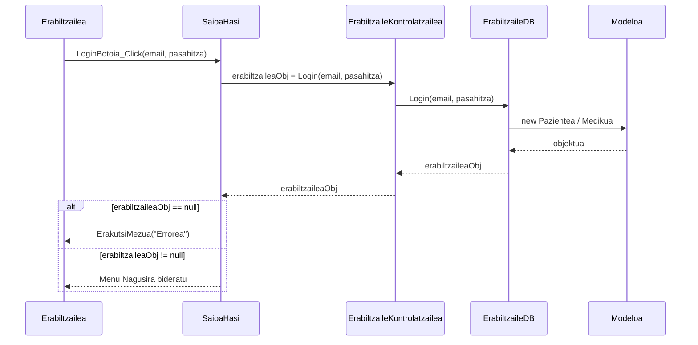

# 1. Saioa Hasi - Sekuentzia Diagrama

Diagrama honek erabiltzaile batek sisteman saioa hastean jarraitzen duen prozesua erakusten du.

## Draw.io-n marrazteko elementuak (Zutabeak):
*   **Aktorea:** Erabiltzailea
*   **Muga / Interfazea:** SaioaHasi
*   **Kontrola:** ErabiltzaileKontrolatzailea
*   **DatuBasea:** ErabiltzaileDB
*   **Klasea:** Erabiltzailea (Modeloa: Pazientea, Medikua...)

## Urratsak (Geziak) Draw.io-n irudikatzeko:
1.  **Erabiltzailea -> Interfazea:** Erabiltzaileak bere Emaila eta Pasahitza sartu eta "Saioa hasi" botoia sakatzen du. Geziaren testua: `LoginBotoia_Click()`
2.  **Interfazea -> Kontrola:** Interfazeak kontrolagailuaren metodoari deitzen dio. Gezi testua: `erabiltzaileaObj = Login(email, pasahitza)`
3.  **Kontrola -> DatuBasea:** Kontrolatzaileak Datu-Baseko `Login` metodoari deitzen dio. Gezi testua: `Login(email, pasahitza)`
4.  **DatuBasea -> Modeloa:** Erregistroa aurkitzean, datuekin objektu bat sortzen da (Herentzia erabiliz). Gezi testua: `new Pazientea(...)` edo `new Medikua(...)`
5.  **Modeloa -> DatuBasea:** Objektuaren instantzia itzultzen da.
6.  **DatuBasea -> Kontrola:** Erabiltzaile objektua (Pazientea/Medikua/Harrerakoa) itzultzen da. Testua: `erabiltzaileaObj`
7.  **Kontrola -> Interfazea:** Saioaren emaitza bidaltzen da.

**[Alt: erabiltzaileaObj == null]**:
7.  **Interfazea -> Erabiltzailea** (Zatikakoa): Errore-mezua pantailan. Testua: `ErakutsiMezua("Erabiltzaile edo pasahitz okerra")`

**[Alt: erabiltzaileaObj != null]**:
8.  **Interfazea -> Erabiltzailea** (Zatikakoa): Dagokion menura sartzeko aukera eman. Testua: `new PazienteMenua() / new MedikuMenua()`

---

## Ikuspegia (Mermaid bidez)

