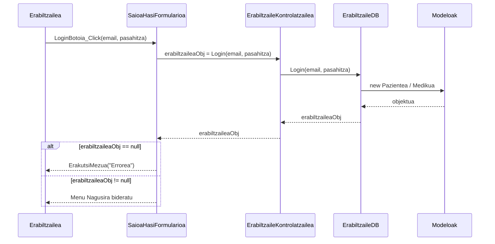

# 1. Saioa Hasi - Sekuentzia Diagrama

Diagrama honek erabiltzaile batek sisteman saioa hastean jarraitzen duen prozesua erakusten du.

## Draw.io-n marrazteko elementuak (Zutabeak):
*   **Aktorea:** Erabiltzailea
*   **Muga / Interfazea:** SaioaHasiFormularioa
*   **Kontrola:** ErabiltzaileKontrolatzailea
*   **Datu-Basea:** ErabiltzaileDB
*   **Klasea:** Erabiltzailea (Modeloak: Pazientea, Medikua...)

## Urratsak (Geziak) Draw.io-n irudikatzeko:
1.  **Erabiltzailea -> Interfazea:** Erabiltzaileak bere Emaila eta Pasahitza sartu eta "Saioa hasi" botoia sakatzen du. Geziaren testua: `LoginBotoia_Click()`
2.  **Interfazea -> Kontrola:** Interfazeak kontrolagailuaren metodoari deitzen dio. Gezi testua: `erabiltzaileaObj = Login(email, pasahitza)`
3.  **Kontrola -> Datu-Basea:** Kontrolak Datu-Base geruzari eskatzen dio balioztapena. Gezi testua: `Login(email, pasahitza)`
4.  **Datu-Basea -> Klasea:** Datu-Baseak datuak irakurri eta objektua sortzen du. Gezi testua: `new Pazientea(...)` edo `new Medikua(...)`
5.  **Datu-Basea -> Kontrola** (Zatikakoa): Bilaketaren emaitza itzultzen du. Testua: `erabiltzaileaObj`
6.  **Kontrola -> Interfazea** (Zatikakoa): Emaitza itzuli.

**[Alt: erabiltzaileaObj == null]**:
7.  **Interfazea -> Erabiltzailea** (Zatikakoa): Errore-mezua pantailan. Testua: `ErakutsiMezua("Erabiltzaile edo pasahitz okerra")`

**[Alt: erabiltzaileaObj != null]**:
8.  **Interfazea -> Erabiltzailea** (Zatikakoa): Dagokion menura sartzeko aukera eman. Testua: `new PazienteMenua() / new MedikuMenua()`

---

## Ikuspegia (Mermaid bidez)

