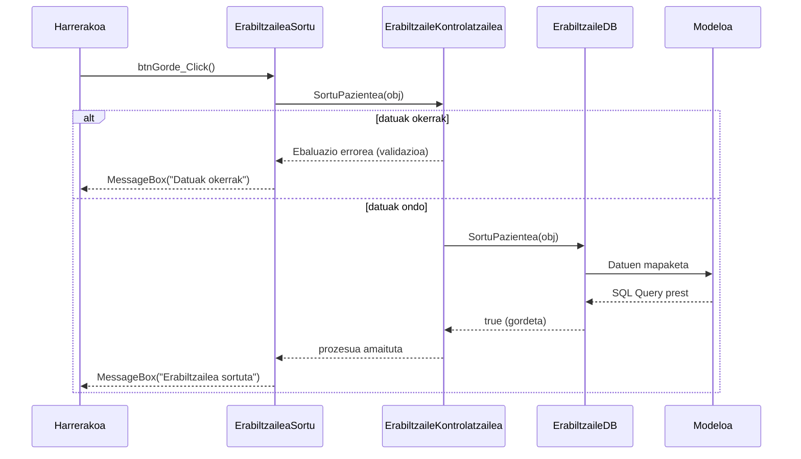

# 2. Erabiltzailea Sortu - Sekuentzia Diagrama

Sistemako langile batek (normalean Harrerakoak) erabiltzaile berri bat sistema barruan erregistratzean ematen den prozesua.

## Draw.io-n marrazteko elementuak (Zutabeak):
*   **Aktorea:** Harrerakoa (edo Administradorea)
*   **Muga / Interfazea:** ErabiltzaileaSortu (Interfazea)
*   **Kontrola:** ErabiltzaileKontrolatzailea (Kontrola)
*   **DatuBasea:** ErabiltzaileDB (DatuBasea)
*   **Modeloa:** Pazientea / Medikua / HarrerakoLangilea (Modeloa)

## Urratsak (Geziak) Draw.io-n irudikatzeko:
1.  **Harrerakoa -> Interfazea:** Datuak bete eta "Gorde" botoia sakatzen du. Gezi testua: `btnGorde_Click()`
2.  **Interfazea -> Kontrola:** Kontrolatzaileari deitzen dio aukeratutako rolaren arabera. Gezi testua: `SortuPazientea(obj)`
3.  **Kontrola -> DatuBasea:** SQL transakzio bat irekitzen da DBan. Gezi testua: `SortuPazientea(obj)`
4.  **DatuBasea -> Modeloa:** Objektuaren datuak erabiliz SQL INSERT query-ak sortzen dira.
5.  **DatuBasea -> Kontrola (Zatikakoa):** `true / false` emaitza itzuli (Transakzioa Commit/Rollback).
6.  **Kontrola -> Interfazea (Zatikakoa):** Sorkuntza ondo joan den adierazi.
7.  **Interfazea -> Harrerakoa (Zatikakoa):** Mezua pantailan. Testua: `MessageBox("Erabiltzailea ondo gorde da")`

---

## Ikuspegia (Mermaid bidez)

