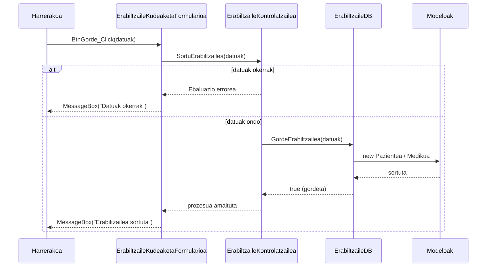

# 2. Erabiltzailea Sortu - Sekuentzia Diagrama

Sistemako langile batek (normalean Harrerakoak) erabiltzaile berri bat sistema barruan erregistratzean ematen den prozesua.

## Draw.io-n marrazteko elementuak (Zutabeak):
*   **Aktorea:** Harrerakoa (edo Administradorea)
*   **Muga / Interfazea:** ErabiltzaileKudeaketaFormularioa (Interfazea)
*   **Kontrola:** ErabiltzaileKontrolatzailea (Kontrola)
*   **Datu-Basea:** ErabiltzaileDB (Datu-basea)
*   **Klasea:** Pazientea / Medikua (Modeloak)

## Urratsak (Geziak) Draw.io-n irudikatzeko:
1.  **Harrerakoa -> Interfazea:** Bezeroaren/Medikuaren datu guztiak idazten ditu eta "Gorde" botoiari ematen dio. Gezi testua: `BtnGorde_Click()`
2.  **Interfazea -> Kontrola:** Funtzioa deitzen da datuekin. Gezi testua: `SortuErabiltzailea(datuak)`
3.  **Kontrola -> Datu-Basea:** Kontrolak SQL geruzari pasatzen dio agindua. Gezi testua: `GordeErabiltzailea(datuak)`
4.  **Datu-Basea -> Klasea:** Datu-Baseak instantzia sortuko du (edo DBra zuzenean bidali). Gezi testua: `new Pazientea(datuak)`
5.  **Klasea -> Datu-Basea** (Zatikakoa): `sortuta`
6.  **Datu-Basea -> Kontrola** (Zatikakoa): `true / false` emaitza itzuli.
7.  **Kontrola -> Interfazea** (Zatikakoa): Sorkuntzaren baieztapena. Testua: `onartuta`
8.  **Interfazea -> Harrerakoa** (Zatikakoa): Erabiltzailea ondo txertatu den abisua. Testua: `MessageBox("Erabiltzailea ondo gorde da")`

---

## Ikuspegia (Mermaid bidez)

