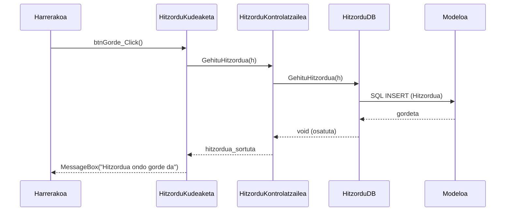

# 3. Hitzordua Hartu - Sekuentzia Diagrama

Harrerako langileak hitzordu berri bat gorde nahi duenean garatzen den fluxua.

## Draw.io-n marrazteko elementuak (Zutabeak):
*   **Aktorea:** Harrerakoa
*   **Muga / Interfazea:** HitzorduKudeaketa (Interfazea)
*   **Kontrola:** HitzorduKontrolatzailea (Kontrola)
*   **DatuBasea:** HitzorduDB (DatuBasea)
*   **Klasea:** Hitzordua (Modeloa)

## Urratsak (Geziak) Draw.io-n irudikatzeko:
1.  **Harrerakoa -> Interfazea:** Bezeroaren datuak hautatu eta "Gorde" sakatzen du. Gezi testua: `btnGorde_Click()`
2.  **Interfazea -> Kontrola:** Kontrolatzaileari deitzen dio hitzordu objektuarekin. Gezi testua: `GehituHitzordua(h)`
3.  **Kontrola -> DatuBasea:** SQL kudeaketarako Datu-Base geruzari deitzen dio. Gezi testua: `GehituHitzordua(h)`
4.  **DatuBasea -> Modeloa:** SQL INSERT sententzia prestatzen du. Gezi testua: `SQL INSERT`
5.  **DatuBasea -> Kontrola (Zatikakoa):** Emaitza itzuli.
6.  **Kontrola -> Interfazea (Zatikakoa):** Prozesua amaitu dela adierazi.
7.  **Interfazea -> Harrerakoa (Zatikakoa):** Baieztapen mezua. Testua: `MessageBox("Hitzordua ondo gorde da")`

---

## Ikuspegia (Mermaid bidez)

