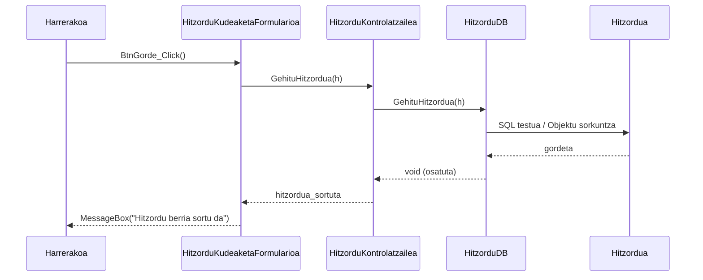

# 3. Hitzordua Hartu - Sekuentzia Diagrama

Harrerako langileak hitzordu berri bat gorde nahi duenean garatzen den fluxua.

## Draw.io-n marrazteko elementuak (Zutabeak):
*   **Aktorea:** Harrerakoa
*   **Muga / Interfazea:** HitzorduKudeaketaFormularioa (Interfazea)
*   **Kontrola:** HitzorduKontrolatzailea (Kontrola)
*   **Datu-Basea:** HitzorduDB (Datu-basea)
*   **Klasea:** Hitzordua (Modeloak)

## Urratsak (Geziak) Draw.io-n irudikatzeko:
1.  **Harrerakoa -> Interfazea:** Pazientea, Medikua, Data eta Ordua aukeratu eta "Gorde" botoiari ematen dio. Gezi testua: `BtnGorde_Click()`
2.  **Interfazea -> Kontrola:** Eskaria kontrolera doan lekua. Testua: `GehituHitzordua(Hitzordua h)`
3.  **Kontrola -> Datu-Basea:** Kontrolak Datu-Baseari eskatzen dio gordetzea. Gezi testua: `GehituHitzordua(h)`
4.  **Datu-Basea -> Klasea:** SQL `INSERT` sententzia eginez. Gezi testua: `new Hitzordua(idPaziente, idMediku, data...)`
5.  **Datu-Basea -> Kontrola** (Zatikakoa): Erantzuna jaso. Testua: `gordeta / errorea`
6.  **Kontrola -> Interfazea** (Zatikakoa): Baieztapena. Testua: `Hitzordua sortuta`
7.  **Interfazea -> Harrerakoa** (Zatikakoa): Baieztapen mezua. Testua: `MessageBox("Hitzordu berria sortu da")`

---

## Ikuspegia (Mermaid bidez)

