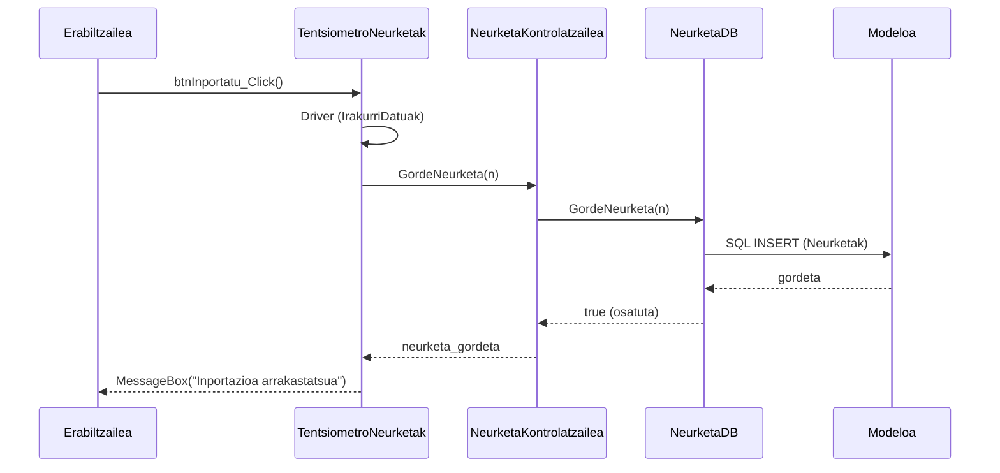

# 4. Neurketa Inportatu - Sekuentzia Diagrama

Pazienteak pisu edo arteria-presio makinetatik gailu bidez jasotako datuak sisteman txertatzen ditu.

## Draw.io-n marrazteko elementuak (Zutabeak):
*   **Aktorea:** Pazientea edo Medikua
*   **Muga / Interfazea:** TentsiometroNeurketak (Interfazea)
*   **Kontrola:** NeurketaKontrolatzailea (Kontrola)
*   **DatuBasea:** NeurketaDB (DatuBasea)
*   **Klasea:** Neurketa (Modeloa)

## Urratsak (Geziak) Draw.io-n irudikatzeko:
1.  **Erabiltzailea -> Interfazea:** Portua hautatu eta botoia sakatzen du. Gezi testua: `btnInportatu_Click()`
2.  **Interfazea -> Gailua (Driver-a):** Driver-ak Serieko Portutik datuak irakurtzen ditu. Testua: `IrakurriDatuak(portNom, isHid, pazienteId)`
3.  **Gailua -> Interfazea:** Neurketa objektua bueltatzen du. Testua: `n`
4.  **Interfazea -> Kontrola:** Neurketa gordetzeko agindua. Testua: `GordeNeurketa(n)`
5.  **Kontrola -> DatuBasea:** SQL kudeaketarako Datu-Base geruzari deitzen dio. Gezi testua: `GordeNeurketa(n)`
6.  **DatuBasea -> Kontrola (Zatikakoa):** Emaitza itzuli (true/false).
7.  **Kontrola -> Interfazea (Zatikakoa):** Gordetzearen baieztapena.
8.  **Interfazea -> Erabiltzailea (Zatikakoa):** Mezua pantailan. Testua: `MessageBox("Neurria ondo inportatu da")`

---

## Ikuspegia (Mermaid bidez)

