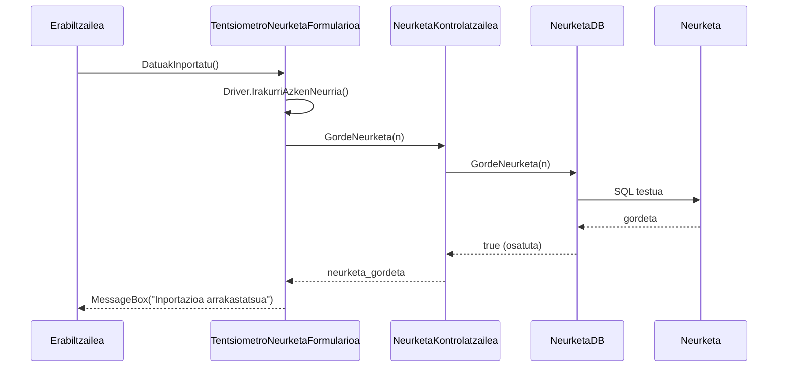

# 4. Neurketa Inportatu - Sekuentzia Diagrama

Pazienteak pisu edo arteria-presio makinetatik gailu bidez jasotako datuak sisteman txertatzen ditu.

## Draw.io-n marrazteko elementuak (Zutabeak):
*   **Aktorea:** Pazientea edo Medikua
*   **Muga / Interfazea:** TentsiometroNeurketaFormularioa (Interfazea)
*   **Kontrola:** NeurketaKontrolatzailea (Kontrola)
*   **Datu-Basea:** NeurketaDB (Datu-basea)
*   **Klasea:** Neurketa (Modeloak)

## Urratsak (Geziak) Draw.io-n irudikatzeko:
1.  **Erabiltzailea -> Interfazea:** Beurer makina edo gailua konektatu eta botoia ematen dio. Testua: `DatuakInportatu()`
2.  **Interfazea -> Gailua (Driver-a):** Driver-ak gailutik datuak irakurtzen ditu. Testua: `IrakurriAzkenNeurria(PORT, isHid, pazienteId)`
3.  **Gailua -> Interfazea:** Datuak bueltatzen ditu. Testua: `Neurketa n`
4.  **Interfazea -> Kontrola:** Neurketa gordetzeko agindua. Testua: `GordeNeurketa(n)`
5.  **Kontrola -> Datu-Basea:** Kontrolak Datu-Baseari eskatzen dio SQL `INSERT` sententzia egitea. Gezi testua: `GordeNeurketa(n)`
6.  **Datu-Basea -> Kontrola** (Zatikakoa): `true / false` emaitza (gordeta).
7.  **Kontrola -> Interfazea** (Zatikakoa): Gordetzearen baieztapena.
8.  **Interfazea -> Erabiltzailea** (Zatikakoa): Baieztapen mezua. Testua: `MessageBox("Neurria ondo inportatu eta gordeta")`

---

## Ikuspegia (Mermaid bidez)

