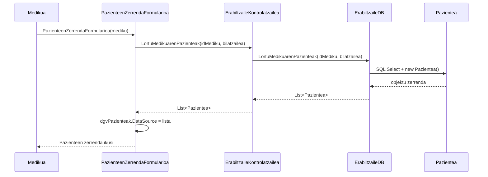

# 5. Paziente Zerrenda Ikusi - Sekuentzia Diagrama

Medikuak saioa hasita duela, bere kargura dauden paziente guztiak kontsultatzen dituen prozesua.

## Draw.io-n marrazteko elementuak (Zutabeak):
*   **Aktorea:** Medikua
*   **Muga / Interfazea:** PazienteenZerrendaFormularioa (Interfazea)
*   **Kontrola:** ErabiltzaileKontrolatzailea (Kontrola)
*   **Datu-Basea:** ErabiltzaileDB (Datu-basea)
*   **Klasea:** Pazientea (Modeloak)

## Urratsak (Geziak) Draw.io-n irudikatzeko:
1.  **Medikua -> Interfazea:** Medikuak menutik "Pazienteak ikusi" atalera klik egiten du. Testua: `PazienteenZerrendaFormularioa(mediku)`
2.  **Interfazea -> Kontrola:** Eskaeraren datuak bidaltzen dizkio. Testua: `LortuMedikuarenPazienteak(medikuId, bilatzailea)`
3.  **Kontrola -> Datu-Basea:** Kontrolak Datu-Baseko geruzari eskatzen dizkio pazienteak. Testua: `LortuMedikuarenPazienteak(medikuId, bilatzailea)`
4.  **Datu-Basea -> Klasea:** SQL `SELECT` testuarekin objektu zerrenda bat sortzen du. Gezi testua: `new Pazientea(...)`
5.  **Datu-Basea -> Kontrola** (Zatikakoa): Pazienteen lista bueltatzen du. Testua: `List<Pazientea>`
6.  **Kontrola -> Interfazea** (Zatikakoa): Sortutako pazienteen lista bueltatzen du.
7.  **Interfazea -> Interfazea:** Pantailako Grid-a eguneratzen da. Testua: `dgvPazienteak.DataSource = lista`
8.  **Interfazea -> Medikua** (Zatikakoa): Pazienteen datu-taula erakutsi pantailan.

---

## Ikuspegia (Mermaid bidez)

