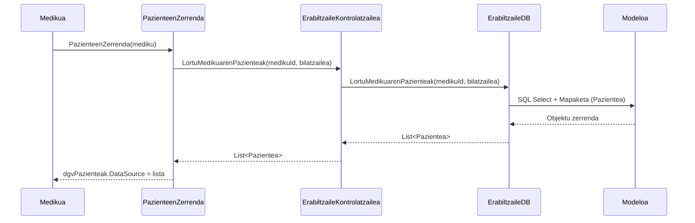

# 5. Paziente Zerrenda Ikusi - Sekuentzia Diagrama

Medikuak saioa hasita duela, bere kargura dauden paziente guztiak kontsultatzen dituen prozesua.

## Draw.io-n marrazteko elementuak (Zutabeak):
*   **Aktorea:** Medikua
*   **Muga / Interfazea:** PazienteenZerrenda (Interfazea)
*   **Kontrola:** ErabiltzaileKontrolatzailea (Kontrola)
*   **DatuBasea:** ErabiltzaileDB (DatuBasea)
*   **Klasea:** Pazientea (Modeloa)

## Urratsak (Geziak) Draw.io-n irudikatzeko:
1.  **Medikua -> Interfazea:** Medikuak menutik "Pazienteak ikusi" sakatzen du. Gezi testua: `PazienteenZerrenda(mediku)`
2.  **Interfazea -> Kontrola:** Kontrolatzaileari deitzen dio medikuaren IDarekin. Gezi testua: `LortuMedikuarenPazienteak(medikuId, bilatzailea)`
3.  **Kontrola -> DatuBasea:** SQL kudeaketarako Datu-Base geruzari deitzen dio. Gezi testua: `LortuMedikuarenPazienteak(medikuId, bilatzailea)`
4.  **DatuBasea -> Modeloa:** SQL SELECT bidezko datuak `Pazientea` objektuetara mapatzen ditu.
5.  **DatuBasea -> Kontrola (Zatikakoa):** `List<Pazientea>` itzuli.
6.  **Kontrola -> Interfazea (Zatikakoa):** Paziente zerrenda bueltatzen du.
7.  **Interfazea -> Medikua (Zatikakoa):** Grid-a eguneratu eta zerrenda erakutsi. Testua: `dgvPazienteak.DataSource = lista`

---

## Ikuspegia (Mermaid bidez)

