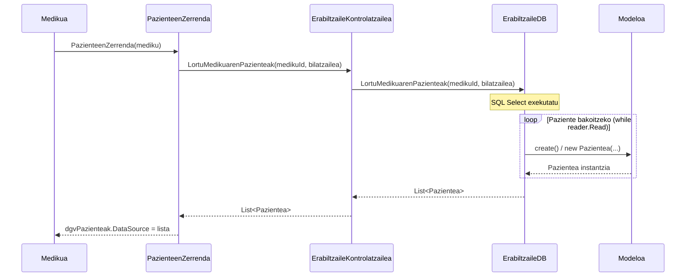

# 5. Paziente Zerrenda Ikusi (Loop-arekin) - Sekuentzia Diagrama

Medikuak saioa hasita duela, bere kargura dauden paziente guztiak kontsultatzen dituen prozesua, datu-baseko "mapping" xehetasuna (loop) erakutsiz.

## Draw.io-n marrazteko elementuak (Zutabeak):
*   **Aktorea:** Medikua
*   **Muga / Interfazea:** PazienteenZerrenda
*   **Kontrola:** ErabiltzaileKontrolatzailea
*   **DatuBasea:** ErabiltzaileDB
*   **Klasea:** Pazientea (Modeloa)

## Urratsak (Geziak) Draw.io-n irudikatzeko:
1.  **Medikua -> Interfazea:** Medikuak menutik "Pazienteak ikusi" sakatzen du. Gezi testua: `PazienteenZerrenda(mediku)`
2.  **Interfazea -> Kontrola:** Kontrolatzaileari deitzen dio medikuaren IDarekin. Gezi testua: `LortuMedikuarenPazienteak(medikuId, bilatzailea)`
3.  **Kontrola -> DatuBasea:** SQL kudeaketarako Datu-Base geruzari deitzen dio. Gezi testua: `LortuMedikuarenPazienteak(medikuId, bilatzailea)`
4.  **DatuBasea:** SQL exekutatu (SELECT).
5.  **Loop [Paziente bakoitzeko (while reader.Read())]**:
    *   **DatuBasea -> Modeloa:** Objektu berria sortu datu-baseko errenkadarekin. Gezi testua: `new Pazientea(...)`
    *   **Modeloa -> DatuBasea:** Objektuaren instantzia itzuli eta zerrendara gehitu.
6.  **DatuBasea -> Kontrola:** `List<Pazientea>` itzuli.
7.  **Kontrola -> Interfazea:** Paziente zerrenda bueltatzen du.
8.  **Interfazea -> Medikua:** Grid-a eguneratu eta zerrenda erakutsi. Testua: `dgvPazienteak.DataSource = lista`

---

## Ikuspegia (Mermaid bidez)

