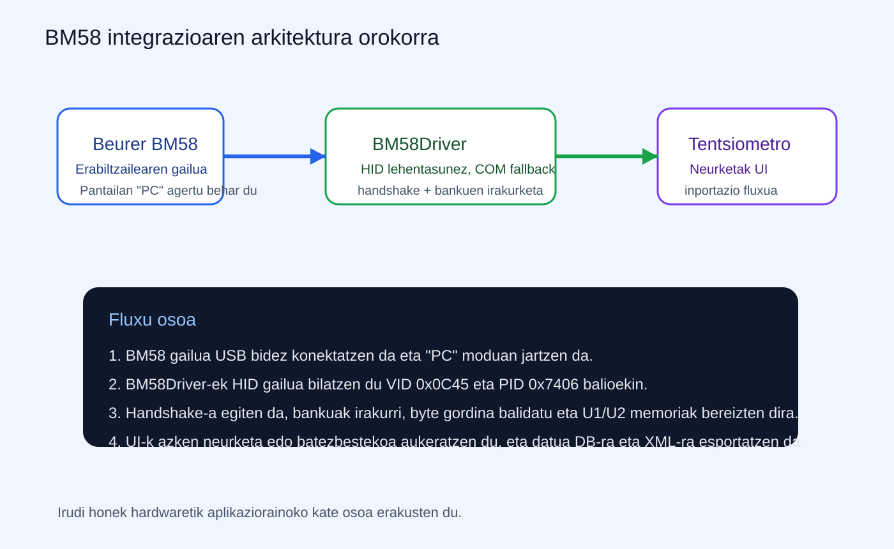
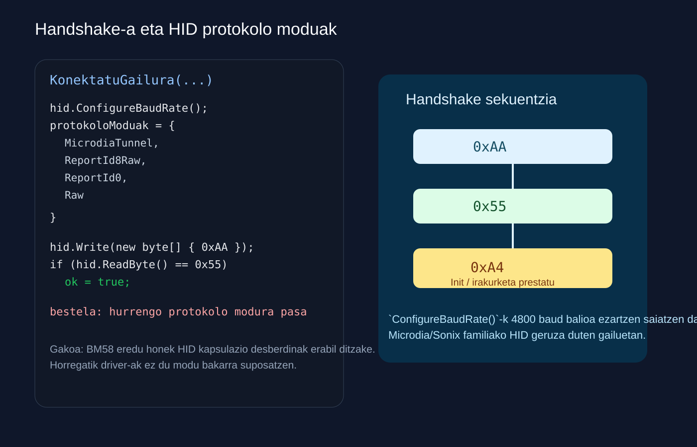
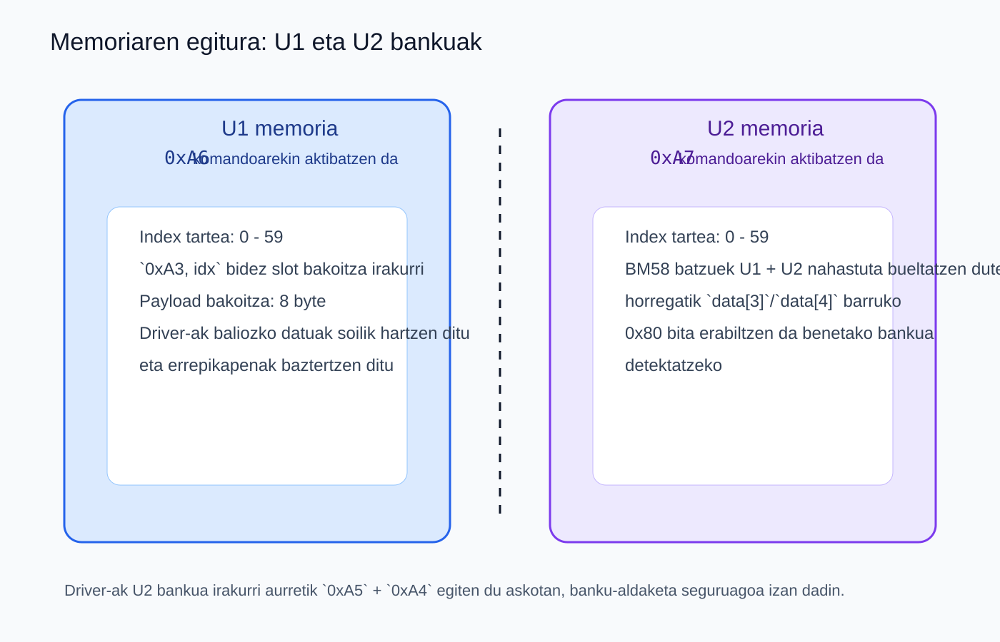
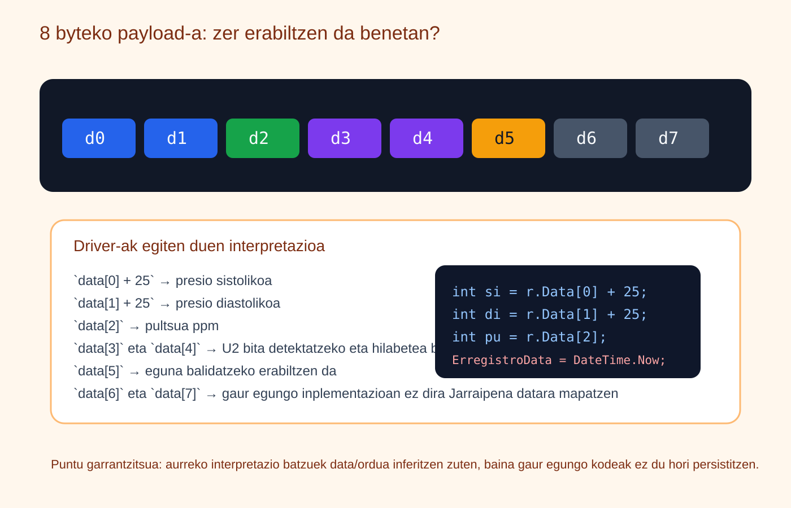
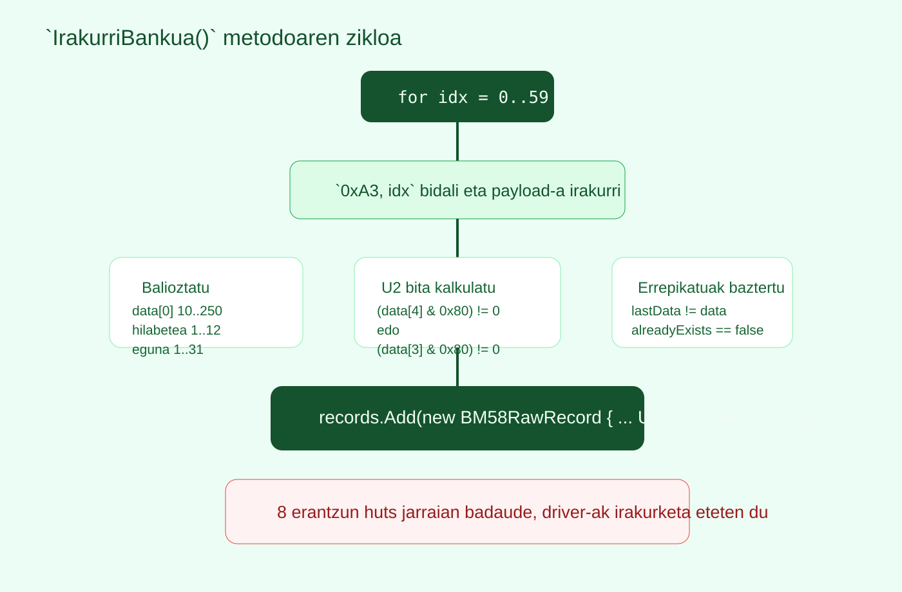
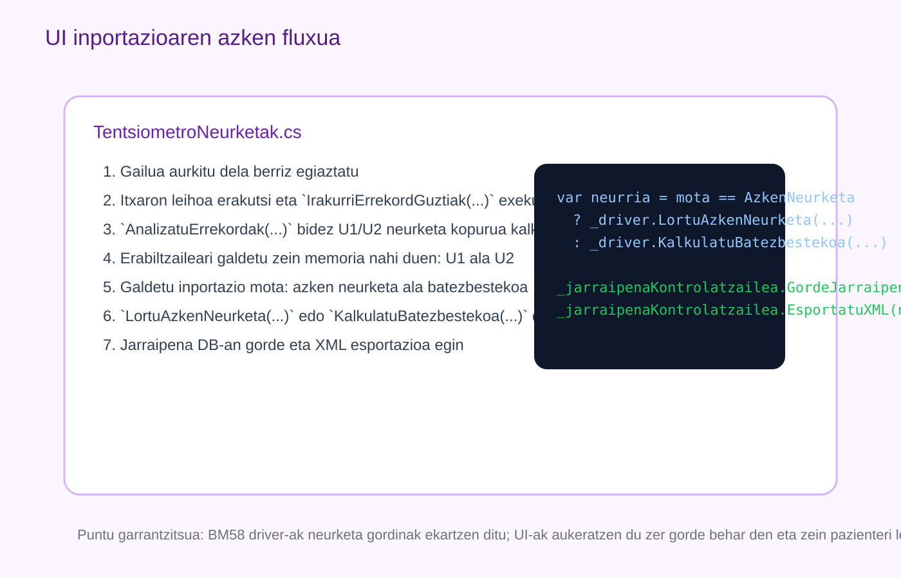

# Beurer BM58 tentsiometroaren inportazioa: driver-a, memoria eta datuen erauzketa

Dokumentu honek azaltzen du nola inportatzen diren Beurer BM58 tentsiometroko presio sistolikoa, presio diastolikoa eta pultsua GOsasun aplikaziora. Azalpena benetan dagoen inplementazioan oinarritzen da, batez ere fitxategi hauetan:

- `GOsasun_app/Kontrola/Zerbitzuak/BM58Driver.cs`
- `GOsasun_app/Interfazea/Osasun_Langilea/TentsiometroNeurketak.cs`

Helburua ez da bakarrik byte batzuk deskribatzea, baizik eta kate osoa ulertzea:

1. nola konektatzen den gure ordenagailua tentsiometroarekin
2. nola aurkitzen duen gailua driver-ak
3. nola egiten den handshake-a
4. nola irakurtzen diren U1 eta U2 memoriak
5. nola ateratzen diren sistolikoa, diastolikoa eta pultsua
6. nola heltzen diren neurketa horiek interfazera, datu-basera eta XML esportaziora

## Azaleko fitxa

- Gailua: `Beurer BM58`
- Konexio nagusia: `USB-HID`
- Fallback-a: `Serie portua (COM)`
- Driver nagusia: `BM58Driver`
- UI nagusia: `TentsiometroNeurketak`
- Datu erabilgarriak: `sistolikoa`, `diastolikoa`, `pultsua`



## 1. Erabiltzaileak zer egiten du fisikoki

Erabiltzailearen ikuspegitik prozesua sinplea da:

1. BM58 gailua USB kablez ordenagailura konektatu.
2. Gailuaren pantailan `PC` modua agertzea ziurtatu.
3. GOsasun aplikazioko tentsiometro inportazio pantaila ireki.
4. Gailua aurkitu denean, datuak deskargatu.

`PC` modua ez bada agertzen, driver-ak ez du komunikaziorik lortuko, nahiz eta kable fisikoki konektatuta egon.

## 2. Driver-ak nola bilatzen duen gailua

Lehenengo urratsa gailua aurkitzea da. `BM58Driver` klaseak bi bide erabiltzen ditu:

1. lehenengo HID gisa bilatzen du
2. aurkitzen ez badu, COM portuetan saiatzen da

Kodearen ideia nagusia hau da:

```csharp
public bool EgiaztatuHardwareKonexioa()
{
    return DeviceList.Local.GetHidDevices(Beurer_VID, Beurer_PID).Any();
}

public string? BilatuGailua(out bool isHid)
{
    isHid = false;

    if (EgiaztatuHardwareKonexioa())
    {
        isHid = true;
        return "USB-HID: Beurer BM58";
    }

    foreach (string portuIzena in SerialPort.GetPortNames())
    {
        // COM bidez saiatu
    }

    return null;
}
```

### Zer esan nahi du honek praktikan?

- HID bidea da bide nagusia, normalean driverrik gehigarririk gabe erabil daitekeelako
- COM bidea fallback gisa geratzen da, gailua edo sistema jakin batean serie moduan agertzen bada
- erabiltzaileak ez du eskuz porturik aukeratu behar; bilaketa automatikoa da

## 3. HID geruza: baud rate-a eta protokolo moduak

BM58-k ez du zertan HID kapsulazio bakar batekin erantzun. Horregatik, `HidChannel` klaseak hainbat protokolo modu probatzen ditu.



`HidChannel` barruan agertzen diren moduak hauek dira:

- `MicrodiaTunnel`
- `ReportId8Raw`
- `ReportId0`
- `Raw`

Gainera, `ConfigureBaudRate()` metodoak 4800 baud balioa ezartzen saiatzen da Microdia/Sonix motako HID geruzetan. Hau garrantzitsua da, BM58 familiako gailu batzuek HID azpian UART-aren antzeko tunel bat erabiltzen dutelako.

Beraz, driver-ak ez du pentsatzen “gailu guztiek modu berean hitz egiten dute”; kontrakoa egiten du:

- hainbat report formatu probatzen ditu
- bufferra garbitzen du saiakera bakoitzean
- handshake-a berriz errepikatzen du behar izanez gero

## 4. Handshake-a: ordenagailua eta tentsiometroa sinkronizatzea

Gailua aurkitu ondoren, `KonektatuGailura(...)` metodoak handshake-a egiten du. Oinarrizko logika hau da:

```csharp
hid.Write(new byte[] { 0xAA });
Thread.Sleep(HandshakeItxaronaldiaMs);

if (hid.ReadByte() == 0x55)
{
    ok = true;
}
```

Interpretazioa:

- `0xAA`: ordenagailuak sinkronizazio eskaera egiten du
- `0x55`: gailuak prest dagoela adierazten du

Handshake-a ondo doanean, irakurketa prestatzeko `0xA4` komandoa bidaltzen da:

```csharp
channel.Write(new byte[] { 0xA4 }); // Init
```

Puntu garrantzitsua: handshake hau ez da saiakera bakarrekoa. Driver-ak hainbat aldiz saiatzen da, eta protokolo moduak txandakatzen ditu erantzun zuzena lortu arte.

## 5. Memoriaren egitura: U1 eta U2 bankuak

BM58 gailuak bi memoria-banku ditu:

- `U1`
- `U2`

Gaur egungo driver-ak 60 indize arte irakurtzen ditu banku bakoitzean. Horregatik `for (int idx = 0; idx < 60; idx++)` ageri da irakurketan.



Banku bakoitza aktibatzeko erabiltzen diren komandoak:

- `0xA6` → U1
- `0xA7` → U2

Eta slot bakoitza irakurtzeko erabiltzen den komandoa:

- `0xA3, idx`

Irakurketa orokorra honela hasten da:

```csharp
channel.Write(new byte[] { 0xA4 });
IrakurriBankua(channel, records, 1, 0xA6);
IrakurriBankua(channel, records, 2, 0xA7);
channel.Write(new byte[] { 0xA5 });
```

Horrek esan nahi du:

1. `Init`
2. U1 irakurri
3. U2 irakurri
4. `End`

### Zergatik egiten da `0xA5` + `0xA4` U2 aurretik?

`IrakurriBankua(...)` barruan, U2 irakurri aurretik driver-ak askotan hau egiten du:

```csharp
channel.Write(new byte[] { 0xA5 });
Thread.Sleep(300);
channel.Write(new byte[] { 0xA4 });
Thread.Sleep(300);
```

Arrazoia da banku-aldaketa segurua izatea. Gailu batzuek U1etik U2ra pasatzean ez dute beti ondo erantzuten egoera berrabiarazi gabe.

## 6. 8 byteko payload-a: nola ateratzen dira sistolikoa, diastolikoa eta pultsua

Slot bakoitzean gailuak 8 byteko payload bat bueltatzen du. Driver-ak payload horretatik ez du gauza bera erabiltzen byte guztietan.



Benetan erabiltzen den mapaketa hau da:

- `data[0]` → presio sistolikoa, baina `+25` offsetarekin
- `data[1]` → presio diastolikoa, baina `+25` offsetarekin
- `data[2]` → pultsua, zuzenean
- `data[3]` eta `data[4]` → U2 bita detektatzeko eta hilabetea balidatzeko
- `data[5]` → eguna balidatzeko
- `data[6]` eta `data[7]` → gaur egungo inplementazioan ez dira `Jarraipena.ErregistroData`-ra mapatzen

Benetako kalkulua hau da:

```csharp
int si = r.Data[0] + 25;
int di = r.Data[1] + 25;
int pu = r.Data[2];
```

### Zergatik `+25`?

Protokolo honek tentsio balioetan offset bat erabiltzen du. Horregatik, raw byte-ari 25 batu behar zaio balio klinikoki erabilgarria lortzeko.

Adibidea:

- `data[0] = 116` → sistolikoa `141`
- `data[1] = 81` → diastolikoa `106`
- `data[2] = 70` → pultsua `70`

## 7. U2 bita eta benetako bankuaren bereizketa

Puntu kritikoa da U2 memoriaren identifikazioa. Driver-aren komentarioak berak dio BM58 “Andon” barruko modelo batzuek U1 eta U2 neurketak nahastuta bidal ditzaketela. Horregatik ez da nahikoa `0xA6` edo `0xA7` bidali dela jakitea; payload barruko marka ere begiratu behar da.

Erabiltzen den logika:

```csharp
bool isU2Month = (data[4] & 0x80) != 0;
bool isU2Year = (data[3] & 0x80) != 0;
bool trueU2Bit = isU2Month || isU2Year;

int benetakoHila = data[4] & 0x7F;
int benetakoUserId = trueU2Bit ? 2 : 1;
```

Interpretazioa:

- `0x80` bita `data[4]` edo `data[3]` barruan badator, driver-ak U2 dela ondorioztatzen du
- `data[4] & 0x7F` egiten da hilabete "garbia" lortzeko, markaren bita kenduta

Hau da arrazoia `records.Add(...)` egitean `userId` parametroa ez izateagatik beti fidagarria: azken `UserId` benetako markaren arabera ezartzen da.

## 8. Baliozkotzea eta irakurketa zikloa

Payload bat jasotzea ez da nahikoa; baliozkoa den ere egiaztatu behar da. `IrakurriBankua(...)` metodoak filtro hauek erabiltzen ditu:

```csharp
bool datuaOn = (data[0] > 10 && data[0] < 250);
bool hilaOn = (benetakoHila >= 1 && benetakoHila <= 12);
bool egunaOn = (data[5] >= 1 && data[5] <= 31);
```

Eta gainera bi babes gehiago ditu:

- `isConsecutiveDuplicate`: aurreko payload bera bada, ez du berriz gehitzen
- `alreadyExists`: lehenagotik zerrendan badago, baztertzen du



Irakurketa zikloaren logika osoa honela laburbil daiteke:

1. `idx` slot bat aukeratu
2. `0xA3, idx` bidali
3. payload-a jaso
4. balioztatu
5. U2 bita kalkulatu
6. errepikapenak kendu
7. `BM58RawRecord` gisa gorde
8. 8 erantzun huts jarraian badaude, banku horretako irakurketa eten

Azken puntu hori garrantzitsua da, driver-ak ez duelako 60 slot guztiak beteta daudela suposatzen.

## 9. Datu gordinetatik `Jarraipena` objektura

Driver-ak ez du zuzenean datu-basean gordetzen. Lehenengo `BM58RawRecord` zerrenda bat sortzen du. Gero, UI-k erabakitzen du zer egin zerrenda horrekin.

Bi aukera nagusi daude:

### 9.1. Azken neurketa

`LortuAzkenNeurketa(...)` metodoak aukeratutako memoriako lehen erregistroa hartzen du (`OrderBy(r => r.Index).FirstOrDefault()`) eta hortik kalkulatzen du:

- sistolikoa
- diastolikoa
- pultsua

### 9.2. Batezbestekoa

`KalkulatuBatezbestekoa(...)` metodoak aukeratutako memoriako neurketa guztiak hartzen ditu, baliozkoak direnak bakarrik kontatu, eta batezbestekoak kalkulatzen ditu.

```csharp
foreach (var r in LortuMemoriakoErrekordak(records, memoria))
{
    int si = r.Data[0] + 25;
    int di = r.Data[1] + 25;
    int pu = r.Data[2];
    // ... batezbesteko metaketa
}
```

### Data eta orduari buruzko ohar garrantzitsua

Nahiz eta payload-ak badituen data/ordu antzeko byteak, gaur egungo kodeak ez du momentu hori erabiliz `ErregistroData` kalkulatzen. Gorde aurretik hau egiten du:

```csharp
ErregistroData = DateTime.Now
```

Beraz, gaur egun GOsasun aplikazioan gordetzen den data aplikazioak inportazioa egin duen unea da, ez tentsiometroak neurria hartu zuen ordua.

## 10. UI-k nola erabiltzen duen driver-a

`TentsiometroNeurketak` pantailak driver-a modu gidatuan erabiltzen du. Fluxua hau da:



1. gailua berriz bilatu
2. datuen deskarga egin ataza asinkrono batean
3. U1/U2 neurketa kopurua erakutsi
4. erabiltzaileari memoria aukeratzeko eskatu
5. azken neurketa ala batezbestekoa aukeratu
6. `Jarraipena` objektua sortu
7. DB-ra gorde
8. XML esportazioa egin

Kodearen muina hemen dago:

```csharp
guztiak = _driver.IrakurriErrekordGuztiak(_portuIzena, _isHid);
var info = _driver.AnalizatuErrekordak(guztiak);

var neurria = inportazioMota == InportazioMota.AzkenNeurketa
    ? _driver.LortuAzkenNeurketa(guztiak, pazienteId, aukeratutakoMemoria)
    : _driver.KalkulatuBatezbestekoa(guztiak, pazienteId, aukeratutakoMemoria);

_jarraipenaKontrolatzailea.GordeJarraipena(neurria);
_jarraipenaKontrolatzailea.EsportatuXML(neurria);
```

Horrek erakusten du ardurak banatuta daudela:

- `BM58Driver` → komunikazioa eta datu gordinen interpretazioa
- `TentsiometroNeurketak` → erabiltzailearen aukerak eta fluxuaren gidaritza
- `JarraipenaKontrolatzailea` → persistentzia eta XML esportazioa

## 11. Laburpena: nola eskuratzen dira sistolikoa, diastolikoa eta pultsua

Azken laburpen exekutiboa hau da:

1. ordenagailuak BM58 gailua USB-HID bidez aurkitzen du
2. handshake-a egiten du `0xAA` / `0x55` bidez
3. `0xA4` bidez irakurketa prestatzen da
4. `0xA6` eta `0xA7` bidez U1 eta U2 bankuak irakurtzen dira
5. slot bakoitzean `0xA3, idx` bidaltzen da
6. jasotako 8 byteko payload-etik:
   - `data[0] + 25` → sistolikoa
   - `data[1] + 25` → diastolikoa
   - `data[2]` → pultsua
7. `data[3]` / `data[4]` erabilita U1 ala U2 den bereizten da
8. UI-k azken neurketa edo batezbestekoa kalkulatzen du
9. emaitza datu-basean eta XML-an gordetzen da

## 12. Mugak eta ondorioak

Gaur egungo inplementazioaren muga nagusiak hauek dira:

- payload barruko data/ordua ez da benetako neurketa-data gisa gordetzen
- eredu batzuek U1/U2 nahastuta ematen dituzte, eta horregatik bit-markaren logikan oinarritu behar da sailkapena
- HID protokolo moduak saiakera anitzekin probatu behar dira, gailu guztiek ez dutelako wrapper bera erabiltzen

Hala ere, gaur egungo driver-a nahikoa sendoa da presio sistolikoa, diastolikoa eta pultsua modu fidagarrian eskuratzeko, baldin eta gailua `PC` moduan badago eta handshake-a ondo egiten bada.

## Entregarako oharra

PDF batera eramaterakoan, gomendagarria da dokumentu hau irudi guztiekin esportatzea, kapitulu bakoitzeko irudia atalaren hasieran jarrita eta kode-zatiak monoespazio formatuan mantenduta.
